# Design Document - Frontend Architecture Refactor

## Overview

Este documento detalha o design técnico para a **Frente 1 — Reestruturação de Pastas** do projeto de refatoração da arquitetura do frontend do EduStock. O objetivo é transformar a estrutura atual plana de componentes (`src/components/` com 20+ arquivos) em uma arquitetura modular organizada por domínio de negócio.

### Escopo da Frente 1

A Frente 1 foca exclusivamente na reorganização física dos arquivos, sem modificar a lógica interna dos componentes. Esta abordagem minimiza riscos e permite validação incremental através de testes automatizados.

**O que está incluído:**
- Criação da nova estrutura de diretórios modular
- Mapeamento detalhado de cada componente para seu destino
- Movimentação física de arquivos preservando conteúdo
- Atualização sistemática de todos os imports

**O que está excluído (outras frentes):**
- Implementação de React Router (Frente 2)
- Refatoração de Sidebar e navegação (Frente 2)
- Simplificação do ProductCard (Frente 3)
- Criação de novas páginas (Frente 2 e 3)

### Contexto Técnico

**Stack atual:**
- React 19 com Vite
- Tailwind CSS v4 (design tokens customizados)
- Motion (animações)
- React Router DOM v7 (instalado, não utilizado)

**Situação atual:**
- 21 componentes em `src/components/` sem organização
- Diretórios `api/`, `lib/`, `pages/` já existem
- Nenhum hook customizado extraído
- Nenhum layout definido

## Architecture

### Princípios de Design

1. **Separação por Responsabilidade**: Componentes UI puros separados de componentes de domínio
2. **Modularização por Domínio**: Features organizadas em módulos independentes
3. **Mudança Incremental**: Movimentação sem alteração de código interno
4. **Validação Contínua**: Testes executados após cada lote de mudanças

### Estrutura Proposta (DEPOIS)

```
frontend/src/
├── api/                      # [MANTIDO] Clientes HTTP e mocks
│   ├── http.js
│   ├── index.js
│   ├── mock.js
│   └── units.js
├── assets/                   # [MANTIDO] Recursos estáticos
│   └── vite.svg
├── components/               # [MODIFICADO] Apenas UI puro reutilizável
│   └── ui/
│       ├── ConfirmDialog.jsx
│       ├── Modal.jsx
│       ├── Tabs.jsx
│       └── Toast.jsx
├── features/                 # [NOVO] Módulos de domínio
│   ├── alertas/
│   │   ├── AlertasView.jsx
│   │   └── AlertTicker.jsx
│   ├── fornecedores/
│   │   ├── FornecedoresView.jsx
│   │   └── FornecedorFormModal.jsx
│   ├── inventario/
│   │   ├── CategoryRail.jsx
│   │   ├── DetailsModal.jsx
│   │   ├── ProductCard.jsx
│   │   └── ProductFormModal.jsx
│   ├── merenda/
│   │   ├── ContagemView.jsx
│   │   ├── ContagemWidget.jsx
│   │   ├── KitchenPanel.jsx
│   │   └── KitchenProductionView.jsx
│   ├── movimentacoes/
│   │   ├── EntradaFormModal.jsx
│   │   ├── MovimentacoesView.jsx
│   │   └── SaidaFormModal.jsx
│   └── relatorios/
│       └── RelatoriosView.jsx
├── hooks/                    # [NOVO] Hooks customizados
│   └── (vazio nesta frente)
├── layouts/                  # [NOVO] Layouts principais
│   ├── Header.jsx           # [MOVIDO] de components/
│   └── Sidebar.jsx          # [MOVIDO] de components/
├── lib/                      # [MANTIDO] Utilitários e helpers
│   ├── catalog.js
│   ├── export.js
│   ├── format.js
│   ├── format.test.js
│   ├── icons.jsx
│   └── prestacaoPdf.js
├── pages/                    # [MANTIDO] Páginas de rota
│   └── DashboardPage.jsx    # [PERMANECE] será refatorado na Frente 2
├── index.css
└── main.jsx
```

### Estrutura Atual (ANTES)

```
frontend/src/
├── api/
├── assets/
├── components/              # [PROBLEMA] 21 componentes sem organização
│   ├── AlertasView.jsx
│   ├── AlertTicker.jsx
│   ├── CategoryRail.jsx
│   ├── ConfirmDialog.jsx
│   ├── ContagemView.jsx
│   ├── ContagemWidget.jsx
│   ├── DetailsModal.jsx
│   ├── EntradaFormModal.jsx
│   ├── FornecedoresView.jsx
│   ├── FornecedorFormModal.jsx
│   ├── Header.jsx
│   ├── KitchenPanel.jsx
│   ├── KitchenProductionView.jsx
│   ├── Modal.jsx
│   ├── MovimentacoesView.jsx
│   ├── ProductCard.jsx
│   ├── ProductFormModal.jsx
│   ├── RelatoriosView.jsx
│   ├── SaidaFormModal.jsx
│   ├── Sidebar.jsx
│   ├── Tabs.jsx
│   └── Toast.jsx
├── lib/
├── pages/
│   └── DashboardPage.jsx
├── index.css
└── main.jsx
```

### Diagrama de Transformação

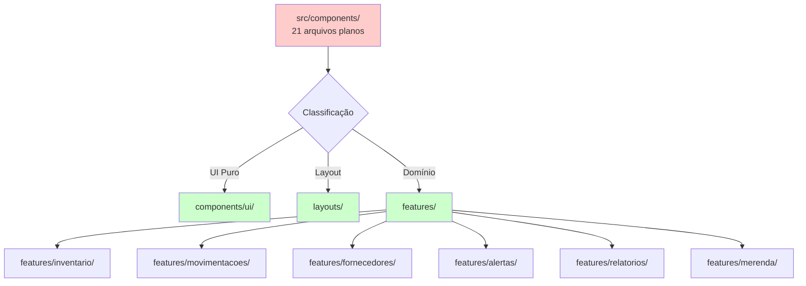

## Components and Interfaces

### Mapeamento Completo de Componentes (Frente 1)


Esta seção detalha EXATAMENTE quais componentes devem ser movidos para onde e por quê.

#### 1. Componentes UI Puros → `components/ui/`

Componentes reutilizáveis sem lógica de negócio específica.

| Componente Atual | Destino | Razão |
|-----------------|---------|-------|
| `Modal.jsx` | `components/ui/Modal.jsx` | Componente de UI genérico com animação. Props: `open`, `onClose`, `title`, `subtitle`, `children`, `maxW`. Sem dependência de domínio. |
| `Toast.jsx` | `components/ui/Toast.jsx` | Sistema de notificações global. Provê `ToastProvider` e `useToast`. Sem lógica de negócio. |
| `ConfirmDialog.jsx` | `components/ui/ConfirmDialog.jsx` | Diálogo de confirmação genérico. Wrapper sobre `Modal`. Props: `open`, `title`, `message`, `onConfirm`, `onCancel`, `confirmLabel`, `tone`. |
| `Tabs.jsx` | `components/ui/Tabs.jsx` | Componente de abas genérico com animação. Props: `tabs`, `active`, `onChange`. Reutilizável para qualquer navegação por abas. |

**Total: 4 componentes**

#### 2. Componentes de Layout → `layouts/`

Componentes estruturais da aplicação.

| Componente Atual | Destino | Razão |
|-----------------|---------|-------|
| `Header.jsx` | `layouts/Header.jsx` | Cabeçalho principal com busca, ações e avatar. Faz parte da estrutura de layout da aplicação. |
| `Sidebar.jsx` | `layouts/Sidebar.jsx` | Barra lateral de navegação. Componente estrutural que será refatorado na Frente 2. |

**Total: 2 componentes**

#### 3. Feature: Inventário → `features/inventario/`

Componentes relacionados à gestão de estoque e produtos.

| Componente Atual | Destino | Razão |
|-----------------|---------|-------|
| `ProductCard.jsx` | `features/inventario/ProductCard.jsx` | Card de exibição de produto com thumbnail, quantidade, barra de nível. Lógica específica de produto (status de estoque, validade). |
| `CategoryRail.jsx` | `features/inventario/CategoryRail.jsx` | Carrossel de categorias para filtrar produtos. Específico do domínio de inventário. |
| `ProductFormModal.jsx` | `features/inventario/ProductFormModal.jsx` | Modal de formulário para criar/editar produtos. CRUD específico de produtos. |
| `DetailsModal.jsx` | `features/inventario/DetailsModal.jsx` | Modal de detalhes completos do produto. Exibe e permite ações sobre produtos. |

**Total: 4 componentes**


#### 4. Feature: Movimentações → `features/movimentacoes/`

Componentes relacionados a entradas e saídas de estoque.

| Componente Atual | Destino | Razão |
|-----------------|---------|-------|
| `MovimentacoesView.jsx` | `features/movimentacoes/MovimentacoesView.jsx` | View principal de movimentações. Exibe histórico de entradas e saídas. |
| `EntradaFormModal.jsx` | `features/movimentacoes/EntradaFormModal.jsx` | Modal de formulário para registrar entrada de estoque. |
| `SaidaFormModal.jsx` | `features/movimentacoes/SaidaFormModal.jsx` | Modal de formulário para registrar saída de estoque. |

**Total: 3 componentes**

#### 5. Feature: Fornecedores → `features/fornecedores/`

Componentes relacionados à gestão de fornecedores.

| Componente Atual | Destino | Razão |
|-----------------|---------|-------|
| `FornecedoresView.jsx` | `features/fornecedores/FornecedoresView.jsx` | View principal de fornecedores. Lista e gerencia fornecedores. |
| `FornecedorFormModal.jsx` | `features/fornecedores/FornecedorFormModal.jsx` | Modal de formulário para criar/editar fornecedores. |

**Total: 2 componentes**

#### 6. Feature: Alertas → `features/alertas/`

Componentes relacionados a alertas de validade e estoque.

| Componente Atual | Destino | Razão |
|-----------------|---------|-------|
| `AlertasView.jsx` | `features/alertas/AlertasView.jsx` | View principal de alertas. Exibe alertas de validade e estoque crítico com filtros. |
| `AlertTicker.jsx` | `features/alertas/AlertTicker.jsx` | Ticker animado de alertas. Componente de notificação em tempo real. |

**Total: 2 componentes**

#### 7. Feature: Relatórios → `features/relatorios/`

Componentes relacionados à geração de relatórios.

| Componente Atual | Destino | Razão |
|-----------------|---------|-------|
| `RelatoriosView.jsx` | `features/relatorios/RelatoriosView.jsx` | View principal de relatórios. Interface para gerar e visualizar relatórios. |

**Total: 1 componente**

#### 8. Feature: Merenda → `features/merenda/`

Componentes relacionados à gestão de merenda escolar.

| Componente Atual | Destino | Razão |
|-----------------|---------|-------|
| `ContagemView.jsx` | `features/merenda/ContagemView.jsx` | View de contagem de alunos. Interface para registrar presença. |
| `ContagemWidget.jsx` | `features/merenda/ContagemWidget.jsx` | Widget de contagem rápida. Componente auxiliar de contagem. |
| `KitchenPanel.jsx` | `features/merenda/KitchenPanel.jsx` | Painel de controle da cozinha. Dashboard específico da cozinha. |
| `KitchenProductionView.jsx` | `features/merenda/KitchenProductionView.jsx` | View de produção da cozinha. Gerencia produção de refeições. |

**Total: 4 componentes**

### Resumo Quantitativo


| Destino | Quantidade | Componentes |
|---------|-----------|-------------|
| `components/ui/` | 4 | Modal, Toast, ConfirmDialog, Tabs |
| `layouts/` | 2 | Header, Sidebar |
| `features/inventario/` | 4 | ProductCard, CategoryRail, ProductFormModal, DetailsModal |
| `features/movimentacoes/` | 3 | MovimentacoesView, EntradaFormModal, SaidaFormModal |
| `features/fornecedores/` | 2 | FornecedoresView, FornecedorFormModal |
| `features/alertas/` | 2 | AlertasView, AlertTicker |
| `features/relatorios/` | 1 | RelatoriosView |
| `features/merenda/` | 4 | ContagemView, ContagemWidget, KitchenPanel, KitchenProductionView |
| **TOTAL** | **22** | — |

### Análise de Dependências entre Componentes

#### Dependências Internas Identificadas

1. **ConfirmDialog → Modal**: ConfirmDialog importa e usa Modal
2. **Toast → createContext/useContext**: Toast provê contexto global
3. **ProductCard → lib/catalog, lib/format, api/units**: Dependências de formatação
4. **AlertasView → motion**: Usa AnimatePresence e motion.button
5. **Todos os modais de formulário → Modal**: Wrappers sobre Modal

#### Fluxo de Dados Mantido

A reorganização **não altera** o fluxo de dados:
- Props continuam sendo passados da mesma forma
- Hooks de estado permanecem nos mesmos componentes
- Chamadas de API não são modificadas
- Context Providers (Toast) mantêm localização lógica

### Atualização de Imports

#### Padrões de Import Atuais

```jsx
// Exemplo em DashboardPage.jsx (ANTES)
import Modal from '../components/Modal'
import ProductCard from '../components/ProductCard'
import AlertasView from '../components/AlertasView'
import Header from '../components/Header'
```

#### Padrões de Import Novos

```jsx
// Exemplo em DashboardPage.jsx (DEPOIS)
import Modal from '../components/ui/Modal'
import ProductCard from '../features/inventario/ProductCard'
import AlertasView from '../features/alertas/AlertasView'
import Header from '../layouts/Header'
```

#### Arquivos que Importam Componentes

Arquivos que precisarão ter imports atualizados:

1. **`pages/DashboardPage.jsx`** - Importa praticamente todos os componentes
2. **`components/ui/ConfirmDialog.jsx`** - Importa Modal
3. **Componentes dentro de features** - Importam Modal, Toast (useToast)


## Data Models

### Estrutura de Diretórios (Modelo de Dados Físico)

Não há alteração nos modelos de dados da aplicação. Esta seção documenta apenas a estrutura física de diretórios.

```typescript
// Representação da estrutura de diretórios
interface DirectoryStructure {
  components: {
    ui: string[]  // Componentes UI puros
  }
  features: {
    [domainName: string]: string[]  // Componentes por domínio
  }
  layouts: string[]  // Componentes de layout
  hooks: string[]    // Hooks customizados (vazio nesta frente)
  api: string[]      // Mantido sem alterações
  lib: string[]      // Mantido sem alterações
  pages: string[]    // Mantido sem alterações
}
```

### Estrutura de Imports (Modelo de Referência)

```typescript
// Padrão de importação após reorganização
type ImportPath = 
  | `@/components/ui/${ComponentName}`
  | `@/features/${DomainName}/${ComponentName}`
  | `@/layouts/${ComponentName}`
  | `@/hooks/${HookName}`
  | `@/api/${ApiModule}`
  | `@/lib/${UtilModule}`

// Exemplos válidos:
// '@/components/ui/Modal'
// '@/features/inventario/ProductCard'
// '@/layouts/Header'
```

**Nota**: O projeto atualmente não usa alias de path (`@/`). Os imports usam caminhos relativos (`../`). Esta seção documenta o padrão conceitual.

## Correctness Properties

**Nota**: Esta seção normalmente contém propriedades universais testáveis via property-based testing. Para esta feature específica, PBT não é aplicável pelas razões detalhadas abaixo.

---

**Property-Based Testing (PBT) não é aplicável para esta feature.**

### Análise de Aplicabilidade

A Frente 1 consiste em uma **refatoração de estrutura de arquivos**, que é fundamentalmente diferente de implementar nova lógica de negócio ou transformações de dados.

#### Por que PBT não se aplica

1. **Não há função pura para testar**
   - A operação é "mover arquivo de A para B" e "atualizar import de X para Y"
   - Não existe um domínio de entrada variável que possa gerar diferentes outputs

2. **Operação determinística e única**
   - Executada uma vez durante a refatoração
   - Não há "para todo arquivo X, quando movido, propriedade P deve ser mantida"
   - O resultado é binário: imports funcionam ou não

3. **Categorização segundo guidelines**
   - **Configuration/Setup check**: Reorganização de projeto
   - **One-shot operation**: Não executada repetidamente
   - **Infrastructure change**: Mudança de organização, não de comportamento

4. **Sem lógica de negócio**
   - Nenhum algoritmo sendo implementado
   - Nenhuma transformação de dados
   - Nenhuma regra de negócio sendo codificada

### Estratégia de Validação Adequada

Em vez de property-based testing, esta refatoração utiliza:

| Método de Validação | Objetivo |
|---------------------|----------|
| **Compilação (Build)** | Garantir que todos os imports são resolvidos |
| **Testes Existentes** | Garantir que funcionalidades permanecem intactas |
| **Análise Estática** | Detectar imports quebrados ou circulares |
| **Teste Manual** | Validar UI e interações funcionam corretamente |

Estas abordagens são mais apropriadas e eficazes para validar refatorações estruturais de código.

## Error Handling

### Estratégia de Validação

A reorganização de arquivos apresenta riscos mínimos de erro em tempo de execução, mas pode causar:

1. **Erros de import não resolvidos**: Paths incorretos após movimentação
2. **Testes falhando**: Imports antigos em arquivos de teste
3. **Referências circulares**: Imports entre componentes movidos

### Mitigação de Riscos

#### 1. Validação de Sintaxe (Compile-time)

```bash
# Executar após cada lote de movimentação
npm run build
```

**Verificação**: Build do Vite deve completar sem erros.

#### 2. Validação de Testes

```bash
# Frontend tests
cd frontend
npm test

# Backend tests (garantia de não-quebra)
cd ..
python manage.py test
```


**Critério de sucesso**: 100% dos testes passando.

#### 3. Validação Manual

Após reorganização completa:

1. **Iniciar dev server**: `npm run dev`
2. **Verificar console**: Sem erros de import
3. **Testar navegação**: Abrir todas as abas do Dashboard
4. **Testar interações**: Abrir modais, criar produtos, visualizar alertas

### Plano de Rollback

Se erros críticos forem detectados:

1. **Git reset**: `git reset --hard HEAD` (se não commitado)
2. **Git revert**: `git revert <commit>` (se já commitado)
3. **Restauração manual**: Mover arquivos de volta às posições originais

## Testing Strategy

### Abordagem de Testes para Frente 1

A Frente 1 **não introduz nova lógica**, portanto **não requer novos testes**. A estratégia foca em **preservar testes existentes**.

### Testes Existentes

#### Frontend (Vitest)

Localização: `frontend/src/lib/format.test.js`

Teste existente:
- Funções de formatação (`qtd`, `dataBR`, etc.)

**Ação necessária**: Nenhuma. Testes de `lib/` não são afetados pela reorganização de `components/`.

#### Backend (Django TestCase)

Localização: `core/tests/`

Testes existentes:
- `test_api.py` - Endpoints da API
- `test_models.py` - Modelos de dados
- `test_operacao.py` - Lógica de operações
- `test_services.py` - Serviços de negócio
- `test_alerts.py` - Sistema de alertas
- `test_relatorios.py` - Geração de relatórios

**Ação necessária**: Nenhuma. Backend não é afetado pela reorganização do frontend.

### Validação Pós-Migração

#### Checklist de Validação

- [ ] **Build**: `npm run build` executa sem erros
- [ ] **Testes**: `npm test` passa 100%
- [ ] **Lint**: `npm run lint` (se configurado) sem erros
- [ ] **Dev server**: `npm run dev` inicia sem erros de console
- [ ] **Funcionalidades**: Todas as abas do Dashboard funcionam
- [ ] **Modais**: Todos os modais abrem e fecham corretamente
- [ ] **Toasts**: Sistema de notificação funciona

### Testes de Integração Manual


#### Cenários de Teste

1. **Inventário**
   - [ ] ProductCard renderiza corretamente
   - [ ] CategoryRail exibe categorias
   - [ ] Modal de detalhes abre ao clicar no produto
   - [ ] Modal de formulário permite criar/editar produto

2. **Movimentações**
   - [ ] View de movimentações exibe histórico
   - [ ] Modal de entrada permite registrar entrada
   - [ ] Modal de saída permite registrar saída

3. **Fornecedores**
   - [ ] View de fornecedores lista fornecedores
   - [ ] Modal de formulário permite criar/editar fornecedor

4. **Alertas**
   - [ ] View de alertas exibe alertas com filtros
   - [ ] AlertTicker anima alertas

5. **Relatórios**
   - [ ] View de relatórios permite gerar relatórios

6. **Merenda**
   - [ ] View de contagem permite registrar presença
   - [ ] Widget de contagem funciona
   - [ ] Painel da cozinha exibe informações
   - [ ] View de produção gerencia refeições

## Migration Strategy (Frente 1)

### Visão Geral da Estratégia

A migração será executada em **4 fases sequenciais**:

1. **Criar nova estrutura de diretórios**
2. **Mover arquivos em lotes por categoria**
3. **Atualizar imports de forma sistemática**
4. **Validar após cada lote**

### Fase 1: Criação de Diretórios

#### Comandos de Criação

```bash
cd frontend/src

# Criar estrutura de componentes UI
mkdir -p components/ui

# Criar estrutura de features
mkdir -p features/inventario
mkdir -p features/movimentacoes
mkdir -p features/fornecedores
mkdir -p features/alertas
mkdir -p features/relatorios
mkdir -p features/merenda

# Criar estrutura de layouts
mkdir -p layouts

# Criar estrutura de hooks (vazio nesta frente)
mkdir -p hooks
```

**Verificação**: `ls -la components/ features/ layouts/ hooks/` deve mostrar estrutura criada.

### Fase 2: Movimentação de Arquivos


#### Lote 1: Componentes UI Puros

**Objetivo**: Mover componentes reutilizáveis sem lógica de negócio.

```bash
# Mover componentes UI
mv components/Modal.jsx components/ui/
mv components/Toast.jsx components/ui/
mv components/ConfirmDialog.jsx components/ui/
mv components/Tabs.jsx components/ui/
```

**Arquivos afetados**: 4  
**Imports a atualizar**: DashboardPage.jsx, outros componentes que usam Modal/Toast

**Verificação pós-lote**:
```bash
npm run build  # Deve falhar com erros de import (esperado)
```

#### Lote 2: Componentes de Layout

```bash
# Mover layouts
mv components/Header.jsx layouts/
mv components/Sidebar.jsx layouts/
```

**Arquivos afetados**: 2  
**Imports a atualizar**: DashboardPage.jsx

#### Lote 3: Feature Inventário

```bash
# Mover componentes de inventário
mv components/ProductCard.jsx features/inventario/
mv components/CategoryRail.jsx features/inventario/
mv components/ProductFormModal.jsx features/inventario/
mv components/DetailsModal.jsx features/inventario/
```

**Arquivos afetados**: 4  
**Imports a atualizar**: DashboardPage.jsx

#### Lote 4: Feature Movimentações

```bash
# Mover componentes de movimentações
mv components/MovimentacoesView.jsx features/movimentacoes/
mv components/EntradaFormModal.jsx features/movimentacoes/
mv components/SaidaFormModal.jsx features/movimentacoes/
```

**Arquivos afetados**: 3  
**Imports a atualizar**: DashboardPage.jsx

#### Lote 5: Feature Fornecedores

```bash
# Mover componentes de fornecedores
mv components/FornecedoresView.jsx features/fornecedores/
mv components/FornecedorFormModal.jsx features/fornecedores/
```

**Arquivos afetados**: 2  
**Imports a atualizar**: DashboardPage.jsx

#### Lote 6: Feature Alertas

```bash
# Mover componentes de alertas
mv components/AlertasView.jsx features/alertas/
mv components/AlertTicker.jsx features/alertas/
```

**Arquivos afetados**: 2  
**Imports a atualizar**: DashboardPage.jsx

#### Lote 7: Feature Relatórios

```bash
# Mover componente de relatórios
mv components/RelatoriosView.jsx features/relatorios/
```

**Arquivos afetados**: 1  
**Imports a atualizar**: DashboardPage.jsx

#### Lote 8: Feature Merenda

```bash
# Mover componentes de merenda
mv components/ContagemView.jsx features/merenda/
mv components/ContagemWidget.jsx features/merenda/
mv components/KitchenPanel.jsx features/merenda/
mv components/KitchenProductionView.jsx features/merenda/
```

**Arquivos afetados**: 4  
**Imports a atualizar**: DashboardPage.jsx


**Resultado final**: Diretório `components/` deve estar vazio (exceto `ui/`).

### Fase 3: Atualização de Imports

#### Estratégia de Busca e Substituição

**Ferramenta recomendada**: Editor de código com busca/substituição em múltiplos arquivos (VS Code, grep, sed).

#### Arquivo Principal: `pages/DashboardPage.jsx`

**Substituições necessárias** (ordem importa):

```javascript
// ANTES
import Modal from '../components/Modal'
import Toast, { ToastProvider, useToast } from '../components/Toast'
import ConfirmDialog from '../components/ConfirmDialog'
import Tabs from '../components/Tabs'
import Header from '../components/Header'
import Sidebar from '../components/Sidebar'
import ProductCard from '../components/ProductCard'
import CategoryRail from '../components/CategoryRail'
import ProductFormModal from '../components/ProductFormModal'
import DetailsModal from '../components/DetailsModal'
import MovimentacoesView from '../components/MovimentacoesView'
import EntradaFormModal from '../components/EntradaFormModal'
import SaidaFormModal from '../components/SaidaFormModal'
import FornecedoresView from '../components/FornecedoresView'
import FornecedorFormModal from '../components/FornecedorFormModal'
import AlertasView from '../components/AlertasView'
import AlertTicker from '../components/AlertTicker'
import RelatoriosView from '../components/RelatoriosView'
import ContagemView from '../components/ContagemView'
import ContagemWidget from '../components/ContagemWidget'
import KitchenPanel from '../components/KitchenPanel'
import KitchenProductionView from '../components/KitchenProductionView'

// DEPOIS
import Modal from '../components/ui/Modal'
import Toast, { ToastProvider, useToast } from '../components/ui/Toast'
import ConfirmDialog from '../components/ui/ConfirmDialog'
import Tabs from '../components/ui/Tabs'
import Header from '../layouts/Header'
import Sidebar from '../layouts/Sidebar'
import ProductCard from '../features/inventario/ProductCard'
import CategoryRail from '../features/inventario/CategoryRail'
import ProductFormModal from '../features/inventario/ProductFormModal'
import DetailsModal from '../features/inventario/DetailsModal'
import MovimentacoesView from '../features/movimentacoes/MovimentacoesView'
import EntradaFormModal from '../features/movimentacoes/EntradaFormModal'
import SaidaFormModal from '../features/movimentacoes/SaidaFormModal'
import FornecedoresView from '../features/fornecedores/FornecedoresView'
import FornecedorFormModal from '../features/fornecedores/FornecedorFormModal'
import AlertasView from '../features/alertas/AlertasView'
import AlertTicker from '../features/alertas/AlertTicker'
import RelatoriosView from '../features/relatorios/RelatoriosView'
import ContagemView from '../features/merenda/ContagemView'
import ContagemWidget from '../features/merenda/ContagemWidget'
import KitchenPanel from '../features/merenda/KitchenPanel'
import KitchenProductionView from '../features/merenda/KitchenProductionView'
```


#### Arquivo: `components/ui/ConfirmDialog.jsx`

```javascript
// ANTES
import Modal from "./Modal"

// DEPOIS
import Modal from "./Modal"  // Sem mudança (mesmo diretório)
```

**Nota**: ConfirmDialog já está em `components/ui/`, então import de Modal permanece relativo.

#### Arquivos de Modais de Features

Todos os modais (ProductFormModal, EntradaFormModal, SaidaFormModal, FornecedorFormModal, DetailsModal) importam Modal:

```javascript
// ANTES (quando estavam em components/)
import Modal from './Modal'

// DEPOIS (em features/{domain}/)
import Modal from '../../components/ui/Modal'
```

#### Arquivos que Usam Toast

Componentes que usam `useToast`:

```javascript
// ANTES
import { useToast } from '../components/Toast'

// DEPOIS
import { useToast } from '../components/ui/Toast'
// OU (se em features/)
import { useToast } from '../../components/ui/Toast'
```

#### Script de Busca e Substituição (Bash)

```bash
#!/bin/bash
# Executar na raiz de frontend/src

# Substituir imports em DashboardPage
sed -i "s|from '../components/Modal'|from '../components/ui/Modal'|g" pages/DashboardPage.jsx
sed -i "s|from '../components/Toast'|from '../components/ui/Toast'|g" pages/DashboardPage.jsx
sed -i "s|from '../components/ConfirmDialog'|from '../components/ui/ConfirmDialog'|g" pages/DashboardPage.jsx
sed -i "s|from '../components/Tabs'|from '../components/ui/Tabs'|g" pages/DashboardPage.jsx
sed -i "s|from '../components/Header'|from '../layouts/Header'|g" pages/DashboardPage.jsx
sed -i "s|from '../components/Sidebar'|from '../layouts/Sidebar'|g" pages/DashboardPage.jsx
sed -i "s|from '../components/ProductCard'|from '../features/inventario/ProductCard'|g" pages/DashboardPage.jsx
sed -i "s|from '../components/CategoryRail'|from '../features/inventario/CategoryRail'|g" pages/DashboardPage.jsx
sed -i "s|from '../components/ProductFormModal'|from '../features/inventario/ProductFormModal'|g" pages/DashboardPage.jsx
sed -i "s|from '../components/DetailsModal'|from '../features/inventario/DetailsModal'|g" pages/DashboardPage.jsx
sed -i "s|from '../components/MovimentacoesView'|from '../features/movimentacoes/MovimentacoesView'|g" pages/DashboardPage.jsx
sed -i "s|from '../components/EntradaFormModal'|from '../features/movimentacoes/EntradaFormModal'|g" pages/DashboardPage.jsx
sed -i "s|from '../components/SaidaFormModal'|from '../features/movimentacoes/SaidaFormModal'|g" pages/DashboardPage.jsx
sed -i "s|from '../components/FornecedoresView'|from '../features/fornecedores/FornecedoresView'|g" pages/DashboardPage.jsx
sed -i "s|from '../components/FornecedorFormModal'|from '../features/fornecedores/FornecedorFormModal'|g" pages/DashboardPage.jsx
sed -i "s|from '../components/AlertasView'|from '../features/alertas/AlertasView'|g" pages/DashboardPage.jsx
sed -i "s|from '../components/AlertTicker'|from '../features/alertas/AlertTicker'|g" pages/DashboardPage.jsx
sed -i "s|from '../components/RelatoriosView'|from '../features/relatorios/RelatoriosView'|g" pages/DashboardPage.jsx
sed -i "s|from '../components/ContagemView'|from '../features/merenda/ContagemView'|g" pages/DashboardPage.jsx
sed -i "s|from '../components/ContagemWidget'|from '../features/merenda/ContagemWidget'|g" pages/DashboardPage.jsx
sed -i "s|from '../components/KitchenPanel'|from '../features/merenda/KitchenPanel'|g" pages/DashboardPage.jsx
sed -i "s|from '../components/KitchenProductionView'|from '../features/merenda/KitchenProductionView'|g" pages/DashboardPage.jsx

# Substituir imports de Modal nos modais de features
find features/ -name "*Modal.jsx" -exec sed -i "s|from './Modal'|from '../../components/ui/Modal'|g" {} \;

# Substituir imports de Toast nos componentes de features
find features/ -name "*.jsx" -exec sed -i "s|from '../components/Toast'|from '../../components/ui/Toast'|g" {} \;
find features/ -name "*.jsx" -exec sed -i "s|from './Toast'|from '../../components/ui/Toast'|g" {} \;
```


**Nota**: Em ambientes Windows (PowerShell), usar ferramentas de busca/substituição do editor ou adaptar scripts.

### Fase 4: Validação Completa

#### Checklist de Validação Final

```bash
# 1. Verificar estrutura de diretórios
tree src/components src/features src/layouts src/hooks

# 2. Verificar que components/ antigo está vazio (exceto ui/)
ls src/components/

# 3. Build sem erros
npm run build

# 4. Testes passando
npm test

# 5. Dev server sem erros
npm run dev
# Abrir http://localhost:5173 e testar funcionalidades
```

#### Critérios de Sucesso

- [ ] Diretório `src/components/` contém apenas subdiretório `ui/`
- [ ] Diretórios `features/`, `layouts/`, `hooks/` criados e populados
- [ ] `npm run build` completa sem erros
- [ ] `npm test` passa 100%
- [ ] Dev server inicia sem erros de console
- [ ] Todas as funcionalidades do Dashboard funcionam
- [ ] Nenhum import quebrado detectado

### Rollback de Emergência

Se a migração falhar após todos os lotes:

```bash
# Opção 1: Git reset (se não commitado)
git checkout .
git clean -fd

# Opção 2: Git revert (se já commitado)
git log  # Encontrar commit da migração
git revert <commit-hash>

# Opção 3: Restauração manual
# Mover todos os arquivos de volta para src/components/
# Reverter todas as mudanças de import
```

## Diagrams

### Diagrama 1: Estrutura ANTES (Estado Atual)

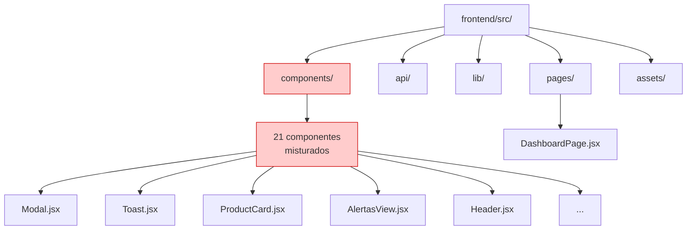

### Diagrama 2: Estrutura DEPOIS (Estado Desejado)


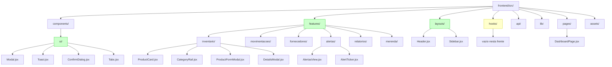

### Diagrama 3: Fluxo de Dados Mantido

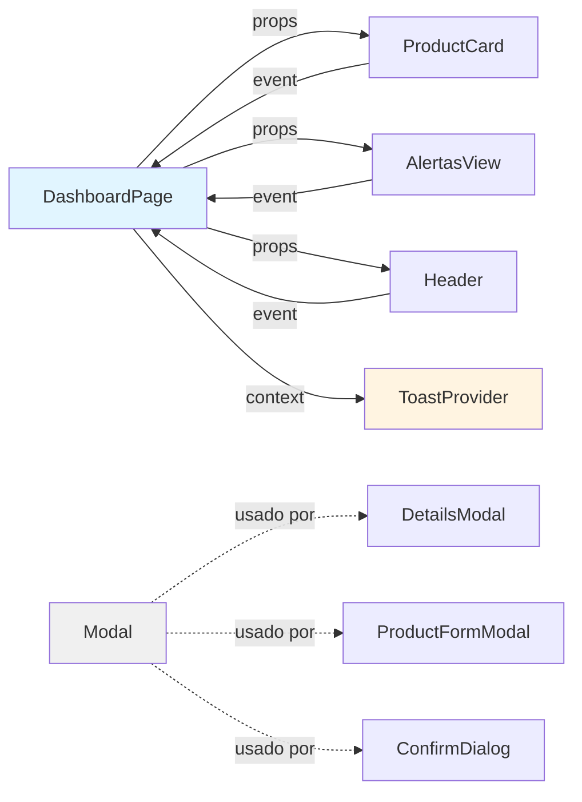

**Legenda**:
- Setas sólidas: Fluxo de dados (props/events)
- Setas pontilhadas: Dependência de componente
- Azul: Páginas
- Amarelo: Context Providers
- Cinza: Componentes UI base

### Diagrama 4: Estratégia de Migração

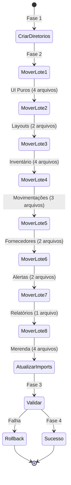


## Technical Considerations

### 1. Preservação de Código Interno

**Princípio crítico**: NENHUM código interno de componentes será modificado na Frente 1.

#### O que será preservado:

- **Lógica de estado**: Todos os `useState`, `useEffect`, `useCallback` permanecem intactos
- **Props e interfaces**: Assinaturas de componentes não mudam
- **Estilos**: Classes Tailwind e inline styles mantidos
- **Animações**: Configurações de `motion` preservadas
- **Comentários**: Documentação interna mantida

#### Exemplo de Movimentação:

```jsx
// ANTES: src/components/Modal.jsx
import { AnimatePresence, motion } from "motion/react"
import { Icon } from "../lib/icons.jsx"

export default function Modal({ open, onClose, title, subtitle, children, maxW = "max-w-lg" }) {
  return (
    <AnimatePresence>
      {/* ... código interno inalterado ... */}
    </AnimatePresence>
  )
}

// DEPOIS: src/components/ui/Modal.jsx
import { AnimatePresence, motion } from "motion/react"
import { Icon } from "../../lib/icons.jsx"  // <-- ÚNICO AJUSTE

export default function Modal({ open, onClose, title, subtitle, children, maxW = "max-w-lg" }) {
  return (
    <AnimatePresence>
      {/* ... código interno inalterado ... */}
    </AnimatePresence>
  )
}
```

**Mudanças permitidas**:
- Ajuste de imports relativos (`../lib/` → `../../lib/`)
- Nada mais

### 2. Ajuste de Imports Relativos

#### Padrões de Profundidade

```
src/
├── components/ui/          # Profundidade 2
│   └── Modal.jsx          # Para lib/: ../../lib/
├── features/inventario/    # Profundidade 2
│   └── ProductCard.jsx    # Para lib/: ../../lib/
├── layouts/                # Profundidade 1
│   └── Header.jsx         # Para lib/: ../lib/
└── pages/                  # Profundidade 1
    └── DashboardPage.jsx  # Para lib/: ../lib/
```

#### Matriz de Ajustes

| De → Para | api/ | lib/ | components/ui/ | features/ | layouts/ |
|-----------|------|------|----------------|-----------|----------|
| **components/ui/** | `../../api/` | `../../lib/` | `./` | `../../features/` | `../../layouts/` |
| **features/{domain}/** | `../../api/` | `../../lib/` | `../../components/ui/` | `../` | `../../layouts/` |
| **layouts/** | `../api/` | `../lib/` | `../components/ui/` | `../features/` | `./` |
| **pages/** | `../api/` | `../lib/` | `../components/ui/` | `../features/` | `../layouts/` |

### 3. Arquivos de Teste

Atualmente, apenas `lib/format.test.js` existe. Componentes não têm testes unitários.

**Ação necessária**: Nenhuma para Frente 1.

**Preparação futura**: Ao adicionar testes de componentes posteriormente:
- Testes devem estar co-locados com componentes
- Exemplo: `features/inventario/ProductCard.test.jsx`
- Imports em testes devem seguir mesma lógica relativa

### 4. Impacto em Ferramentas de Build


#### Vite

**Configuração atual**: Nenhuma customização de paths em `vite.config.js`.

**Impacto**: Zero. Vite resolve imports relativos automaticamente.

**Verificação pós-migração**:
```bash
npm run build
# Deve completar sem erros
# Bundle size não deve mudar significativamente
```

#### Tailwind CSS

**Configuração atual**: Design tokens customizados em `index.css` com diretiva `@theme`.

**Impacto**: Zero. Classes CSS são independentes da estrutura de diretórios.

**Verificação**: Estilos visuais devem permanecer idênticos.

#### ESLint / Prettier (se configurados)

**Impacto**: Potencialmente mínimo. Regras de import podem gerar warnings se:
- Houver preferência por imports absolutos
- Houver regras de ordenação de imports

**Mitigação**: Executar `npm run lint --fix` após migração (se lint configurado).

### 5. Performance e Bundle Size

#### Expectativa

**Tamanho do bundle**: Sem alteração esperada.  
**Performance em runtime**: Sem alteração esperada.

A reorganização de arquivos não afeta:
- Code splitting automático do Vite
- Tree shaking
- Minificação
- Lazy loading

#### Métricas de Validação

```bash
# Antes da migração
npm run build
# Anotar: Bundle size, tempo de build

# Depois da migração
npm run build
# Comparar: Bundle size não deve aumentar >1%
```

### 6. Compatibilidade com Apps Independentes

#### app-alunos/ e app-cozinha/

**Impacto**: Zero. Apps são completamente independentes.

**Estrutura deles**:
```
app-alunos/src/
├── api.js
├── App.jsx
├── ContagemView.jsx
├── PinLogin.jsx
└── main.jsx
```

**Garantia**: Nenhum arquivo em `app-alunos/` ou `app-cozinha/` será modificado.

### 7. Considerações de Manutenibilidade Futura

#### Benefícios da Nova Estrutura

1. **Descobrabilidade**: Desenvolvedores encontram componentes por domínio
2. **Isolamento**: Mudanças em um módulo não afetam outros
3. **Escalabilidade**: Fácil adicionar novos features/
4. **Testes**: Estrutura facilita testes focados por feature

#### Convenções Estabelecidas

**Regra para novos componentes**:

1. **É UI puro?** → `components/ui/`
2. **É específico de domínio?** → `features/{domain}/`
3. **É estrutural?** → `layouts/`
4. **É hook?** → `hooks/`

**Exemplo de decisão**:
- Novo componente `ProductQuickActions.jsx` → `features/inventario/` (específico de produto)
- Novo componente `Dropdown.jsx` → `components/ui/` (genérico reutilizável)
- Novo hook `useProductSearch.js` → `hooks/` (lógica reutilizável)

### 8. Limitações Conhecidas


#### O que NÃO é resolvido na Frente 1

1. **Navegação ainda é por abas**: DashboardPage ainda usa Tabs.jsx (resolvido na Frente 2)
2. **ProductCard ainda sobrecarregado**: Card ainda exibe muita informação (resolvido na Frente 3)
3. **Nenhum hook extraído**: Lógica de dados ainda no DashboardPage (resolvido na Frente 2)
4. **Nenhuma página nova**: Apenas DashboardPage existe (resolvido nas Frentes 2 e 3)

#### Dependências entre Frentes

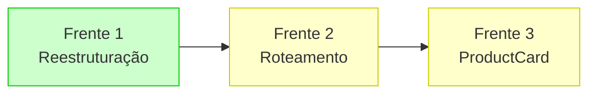

**Frente 1** é pré-requisito para Frentes 2 e 3, pois estabelece a estrutura base.

### 9. Riscos e Mitigações

| Risco | Probabilidade | Impacto | Mitigação |
|-------|---------------|---------|-----------|
| Imports quebrados após movimentação | Alta | Alto | Validação incremental com build após cada lote |
| Testes falhando | Média | Médio | Executar `npm test` após cada lote |
| Perda de histórico Git | Baixa | Baixo | Usar `git mv` ao invés de `mv` para preservar histórico |
| Imports circulares introduzidos | Baixa | Médio | Code review antes de commit |
| Conflitos de merge | Média | Médio | Executar em branch separada, merge após validação |

### 10. Checklist de Pré-Requisitos

Antes de iniciar a migração:

- [ ] Branch de trabalho criado: `git checkout -b feature/frontend-architecture-frente-1`
- [ ] Código atual commitado: `git status` limpo
- [ ] Testes passando: `npm test` 100% OK
- [ ] Build funcionando: `npm run build` sem erros
- [ ] Backup local criado (opcional): `cp -r frontend frontend.backup`
- [ ] Ambiente de desenvolvimento estável
- [ ] Tempo reservado para migração completa (estimativa: 2-4 horas)

### 11. Entregáveis da Frente 1

Ao concluir a Frente 1, os seguintes artefatos devem existir:

1. **Nova estrutura de diretórios**:
   - `src/components/ui/` com 4 componentes
   - `src/features/{6 domínios}/` com 16 componentes
   - `src/layouts/` com 2 componentes
   - `src/hooks/` vazio (para uso futuro)

2. **Arquivos movidos**: 22 componentes reorganizados

3. **Imports atualizados**: Todos os imports corrigidos

4. **Validação completa**: Build e testes passando

5. **Documentação**: Este design document

6. **Commit Git**: Mudanças commitadas com mensagem descritiva

### 12. Critérios de Aceitação

A Frente 1 está completa quando:

✅ Estrutura de diretórios corresponde ao design  
✅ Todos os 22 componentes movidos para locais corretos  
✅ `npm run build` completa sem erros  
✅ `npm test` passa 100%  
✅ `npm run dev` inicia sem erros de console  
✅ Todas as abas do Dashboard funcionam  
✅ Modais abrem e fecham corretamente  
✅ Toasts aparecem em ações  
✅ Nenhum warning de import no console do navegador  
✅ Apps `app-alunos/` e `app-cozinha/` não afetados  
✅ Código commitado com mensagem clara  

---

## Próximos Passos (Fora do Escopo da Frente 1)

Após conclusão da Frente 1, as próximas atividades serão:

**Frente 2: Roteamento e Navegação**
- Configurar React Router em main.jsx
- Criar MainLayout com Sidebar funcional
- Criar páginas finas para cada rota
- Extrair hook useDashboardData
- Remover navegação por abas

**Frente 3: Simplificação e Páginas Finais**
- Simplificar ProductCard
- Criar DetailsModal completo
- Criar PerfilPage
- Criar ConfiguracoesPage
- Atualizar Header com avatar clicável

---

**Versão do Documento**: 1.0  
**Data**: 2024  
**Status**: Aguardando aprovação para execução

---

# Frente 2 - Roteamento e Navegação

## Overview

Esta seção detalha o design técnico para a **Frente 2 — React Router e Navegação** do projeto de refatoração da arquitetura do frontend do EduStock. O objetivo é substituir a navegação baseada em abas (Tabs.jsx + useState) por navegação real usando React Router DOM v7, com Sidebar funcional e páginas dedicadas para cada seção.

### Escopo da Frente 2

A Frente 2 transforma a navegação de um sistema monolítico de abas para arquitetura de rotas, criando páginas finas e extraindo lógica de dados reutilizável.

**O que está incluído:**
- Configuração completa do React Router DOM v7 em main.jsx
- Criação de MainLayout.jsx com Sidebar + Header + Outlet
- Refatoração de Sidebar.jsx para navegação funcional com NavLink
- Extração de hook useDashboardData.js com lógica de fetch
- Criação de 6 páginas finas: InventarioPage, MovimentacoesPage, AlertasPage, FornecedoresPage, RelatoriosPage, MerendaPage
- Remoção de navegação por abas (Tabs.jsx continua em components/ui/ para uso interno)

**O que está excluído (outras frentes):**
- Reestruturação de pastas (Frente 1 - já concluída)
- Simplificação do ProductCard (Frente 3)
- Criação de PerfilPage e ConfiguracoesPage (Frente 3)
- Atualização de Header com avatar clicável (Frente 3)

### Pré-requisitos

- ✅ Frente 1 concluída: estrutura de diretórios modular já existe
- ✅ React Router DOM v7 já instalado em package.json
- ✅ Componentes já organizados em features/, layouts/, components/ui/

### Contexto Técnico

**Situação atual (pós-Frente 1):**
- DashboardPage.jsx monolítico (~300 linhas)
- Navegação por Tabs.jsx com 8 abas controladas por useState
- Sidebar.jsx com 4 botões decorativos não funcionais
- Toda lógica de dados concentrada no DashboardPage

**Situação desejada (pós-Frente 2):**
- React Router configurado com 8 rotas
- MainLayout com Sidebar funcional usando NavLink
- 6 páginas finas (≤60 linhas cada)
- Hook useDashboardData.js reutilizável
- DashboardPage.jsx deletado

## Architecture

### Princípios de Design

1. **Roteamento Declarativo**: Rotas definidas de forma clara e centralizada
2. **Páginas Finas**: Cada página com responsabilidade única e tamanho limitado
3. **Lógica Reutilizável**: Hook compartilhado para busca de dados
4. **Navegação Consistente**: Layout wrapper unificado para todas as rotas
5. **URLs Significativas**: Rotas refletem estrutura de negócio

### Estrutura de Rotas

```
/                     → Redirect para /inventario
/inventario           → InventarioPage
/movimentacoes        → MovimentacoesPage
/alertas              → AlertasPage
/fornecedores         → FornecedoresPage
/relatorios           → RelatoriosPage
/merenda              → MerendaPage
/perfil               → (Frente 3)
/configuracoes        → (Frente 3)
```

### Arquitetura de Componentes

```
main.jsx
  └── BrowserRouter
      └── Routes
          └── Route path="/" element={<MainLayout />}
              ├── Route index (redirect to /inventario)
              ├── Route path="inventario" element={<InventarioPage />}
              ├── Route path="movimentacoes" element={<MovimentacoesPage />}
              ├── Route path="alertas" element={<AlertasPage />}
              ├── Route path="fornecedores" element={<FornecedoresPage />}
              ├── Route path="relatorios" element={<RelatoriosPage />}
              └── Route path="merenda" element={<MerendaPage />}

MainLayout.jsx
  ├── Sidebar (NavLink navigation)
  ├── Header (search, actions)
  └── Outlet (renders matched route)
```


### Diagrama de Arquitetura de Roteamento

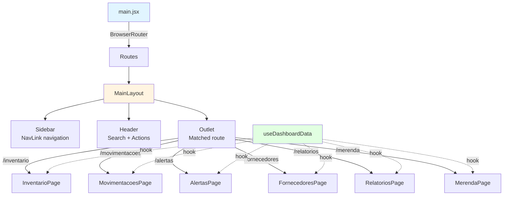

### Fluxo de Dados com useDashboardData

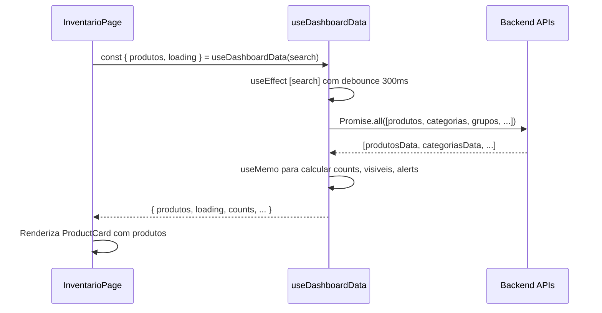

## Components and Interfaces

### Componentes Novos (Frente 2)

#### 1. MainLayout.jsx

**Localização**: `layouts/MainLayout.jsx`

**Responsabilidade**: Layout wrapper que fornece estrutura visual consistente para todas as rotas.

**Interface**:
```jsx
function MainLayout()
```

**Estrutura**:
```jsx
<ToastProvider>
  <div className="flex h-screen">
    <Sidebar />
    <div className="flex-1 flex flex-col">
      <Header />
      <main className="flex-1 overflow-auto">
        <Outlet /> {/* React Router injeta página aqui */}
      </main>
    </div>
  </div>
</ToastProvider>
```

**Props**: Nenhuma (usa Outlet do React Router)

**Dependências**:
- `react-router-dom` (Outlet)
- `../layouts/Sidebar`
- `../layouts/Header`
- `../components/ui/Toast` (ToastProvider)


#### 2. useDashboardData.js

**Localização**: `hooks/useDashboardData.js`

**Responsabilidade**: Hook customizado que centraliza lógica de fetch e processamento de dados do dashboard.

**Interface**:
```javascript
/**
 * Hook para gerenciar dados do dashboard com busca debounced
 * @param {string} initialSearch - Termo de busca inicial
 * @returns {Object} Dados e funções do dashboard
 */
function useDashboardData(initialSearch = '')
```

**Retorno**:
```javascript
{
  // Dados brutos da API
  produtos: Array,
  categorias: Array,
  grupos: Array,
  fornecedores: Array,
  movimentacoes: Array,
  alertas: Array,
  
  // Estado de carregamento
  loading: boolean,
  
  // Busca
  search: string,
  setSearch: Function,
  
  // Função de refresh
  carregar: Function,
  
  // Dados computados (useMemo)
  counts: {
    produtos: number,
    categorias: number,
    fornecedores: number,
    movimentacoes: number
  },
  visiveis: Array, // Produtos filtrados por busca
  alerts: {
    vencidos: number,
    criticos: number,
    total: number
  },
  resumo: {
    valorTotal: number,
    itensAtivos: number
  }
}
```

**Implementação**:
- `useState` para produtos, categorias, grupos, fornecedores, movimentacoes, alertas, loading, search
- `useEffect` com debounce de 300ms para busca
- `Promise.all` para 6 endpoints simultâneos
- `useMemo` para cálculos derivados (counts, visiveis, alerts, resumo)
- Função `carregar()` para refresh manual

**Endpoints utilizados**:
```javascript
Promise.all([
  produtosApi.getAll(),
  categoriasApi.getAll(),
  gruposApi.getAll(),
  fornecedoresApi.getAll(),
  movimentacoesApi.getAll(),
  alertasApi.getAll()
])
```


#### 3. Páginas Finas (6 arquivos)

**Localização**: `pages/{NomePage}.jsx`

**Restrição de tamanho**: Máximo 60 linhas por página

**Padrão comum**:
```jsx
import { useDashboardData } from '../hooks/useDashboardData'
import ComponenteView from '../features/{dominio}/ComponenteView'

export default function NomePage() {
  const { dados, loading, carregar } = useDashboardData()
  
  if (loading) return <div>Carregando...</div>
  
  return (
    <div className="p-6">
      <ComponenteView dados={dados} onRefresh={carregar} />
    </div>
  )
}
```

##### 3.1 InventarioPage.jsx

**Props consumidas de useDashboardData**:
- `produtos` - Lista de produtos
- `categorias` - Lista de categorias
- `visiveis` - Produtos filtrados
- `search` - Termo de busca atual
- `setSearch` - Função para atualizar busca
- `carregar` - Função de refresh
- `loading` - Estado de carregamento

**Componentes renderizados**:
- `CategoryRail` (filtro de categorias)
- Grid de `ProductCard`
- `ProductFormModal` (criação/edição)
- `DetailsModal` (visualização completa)

##### 3.2 MovimentacoesPage.jsx

**Props consumidas**:
- `movimentacoes`
- `produtos`
- `carregar`
- `loading`

**Componentes renderizados**:
- `MovimentacoesView` (tabela de movimentações)
- `EntradaFormModal`
- `SaidaFormModal`

##### 3.3 AlertasPage.jsx

**Props consumidas**:
- `alertas`
- `alerts` (resumo computado)
- `carregar`
- `loading`

**Componentes renderizados**:
- `AlertasView` (lista de alertas com filtros)
- `AlertTicker` (ticker animado)

##### 3.4 FornecedoresPage.jsx

**Props consumidas**:
- `fornecedores`
- `carregar`
- `loading`

**Componentes renderizados**:
- `FornecedoresView` (lista de fornecedores)
- `FornecedorFormModal`

##### 3.5 RelatoriosPage.jsx

**Props consumidas**:
- `produtos`
- `movimentacoes`
- `fornecedores`
- `loading`

**Componentes renderizados**:
- `RelatoriosView` (interface de geração de relatórios)

##### 3.6 MerendaPage.jsx

**Props consumidas**:
- `produtos` (filtrados por categoria merenda)
- `carregar`
- `loading`

**Componentes renderizados**:
- `ContagemView` (registro de presença)
- `ContagemWidget`
- `KitchenPanel`
- `KitchenProductionView`


### Componentes Refatorados (Frente 2)

#### 1. Sidebar.jsx (Refatoração)

**Localização**: `layouts/Sidebar.jsx` (já movido na Frente 1)

**Mudanças**:
- ❌ Remover botões decorativos não funcionais
- ✅ Adicionar NavLink do react-router-dom
- ✅ Adicionar 8 itens de navegação
- ✅ Implementar estilo ativo com NavLink
- ✅ Implementar responsividade (w-56 desktop, w-16 mobile)

**Interface**:
```jsx
function Sidebar()
```

**Estrutura de Navegação**:
```jsx
<aside className="w-56 lg:w-56 md:w-16">
  <nav>
    {/* Seção Operacional */}
    <div>
      <NavLink to="/inventario">Inventário</NavLink>
      <NavLink to="/movimentacoes">Movimentações</NavLink>
      <NavLink to="/alertas">Alertas</NavLink>
    </div>
    
    {/* Seção Gestão */}
    <div>
      <NavLink to="/fornecedores">Fornecedores</NavLink>
      <NavLink to="/relatorios">Relatórios</NavLink>
      <NavLink to="/merenda">Merenda</NavLink>
    </div>
    
    {/* Seção Sistema */}
    <div>
      <NavLink to="/perfil">Perfil</NavLink>
      <NavLink to="/configuracoes">Configurações</NavLink>
    </div>
  </nav>
</aside>
```

**Estilos NavLink**:
```jsx
<NavLink 
  to={path}
  className={({ isActive }) => 
    `flex items-center gap-3 px-4 py-2.5 rounded-lg transition ${
      isActive 
        ? 'bg-brand text-[#f4f1e7]' 
        : 'text-neutral-600 hover:bg-neutral-100'
    }`
  }
>
  <Icon />
  <span className="hidden lg:inline">{label}</span>
</NavLink>
```

**Props**: Nenhuma

**Dependências**:
- `react-router-dom` (NavLink)
- `../lib/icons` (ícones dos itens)


#### 2. main.jsx (Refatoração)

**Localização**: `main.jsx`

**Mudanças**:
- ✅ Importar BrowserRouter, Routes, Route, Navigate do react-router-dom
- ✅ Envolver App com BrowserRouter
- ✅ Configurar estrutura de rotas
- ✅ Adicionar rota raiz com redirect para /inventario

**Implementação ANTES (atual)**:
```jsx
import { StrictMode } from 'react'
import { createRoot } from 'react-dom/client'
import './index.css'
import App from './App.jsx'

createRoot(document.getElementById('root')).render(
  <StrictMode>
    <App />
  </StrictMode>,
)
```

**Implementação DEPOIS (desejado)**:
```jsx
import { StrictMode } from 'react'
import { createRoot } from 'react-dom/client'
import { BrowserRouter, Routes, Route, Navigate } from 'react-router-dom'
import './index.css'

import MainLayout from './layouts/MainLayout'
import InventarioPage from './pages/InventarioPage'
import MovimentacoesPage from './pages/MovimentacoesPage'
import AlertasPage from './pages/AlertasPage'
import FornecedoresPage from './pages/FornecedoresPage'
import RelatoriosPage from './pages/RelatoriosPage'
import MerendaPage from './pages/MerendaPage'

createRoot(document.getElementById('root')).render(
  <StrictMode>
    <BrowserRouter>
      <Routes>
        <Route path="/" element={<MainLayout />}>
          <Route index element={<Navigate to="/inventario" replace />} />
          <Route path="inventario" element={<InventarioPage />} />
          <Route path="movimentacoes" element={<MovimentacoesPage />} />
          <Route path="alertas" element={<AlertasPage />} />
          <Route path="fornecedores" element={<FornecedoresPage />} />
          <Route path="relatorios" element={<RelatoriosPage />} />
          <Route path="merenda" element={<MerendaPage />} />
        </Route>
      </Routes>
    </BrowserRouter>
  </StrictMode>,
)
```

**Nota**: App.jsx pode ser deletado se não tiver mais função após extração para MainLayout.


#### 3. DashboardPage.jsx (Extração e Remoção)

**Status**: Será deletado após criação das páginas finas

**Estratégia de extração**:

1. **Lógica de dados** → `useDashboardData.js`
   - Todos os `useState` para produtos, categorias, etc.
   - Função `carregar()` com Promise.all
   - Debounce de busca
   - useMemo para cálculos

2. **Renderização de inventário** → `InventarioPage.jsx`
   - Grid de ProductCard
   - CategoryRail
   - Modais de criação/edição/detalhes

3. **Renderização de outras abas** → Páginas específicas
   - MovimentacoesPage, AlertasPage, etc.

4. **Layout estrutural** → `MainLayout.jsx`
   - Sidebar + Header + Outlet

**Validação pré-remoção**:
- [ ] Todas as 6 páginas criadas e funcionais
- [ ] useDashboardData testado e validado
- [ ] MainLayout renderizando corretamente
- [ ] Nenhuma funcionalidade perdida

**Comando de remoção**:
```bash
# Somente após validação completa
rm frontend/src/pages/DashboardPage.jsx
```

### Mapeamento de Componentes de View para Páginas

| Componente de View | Localização Atual | Página de Destino | Razão |
|-------------------|------------------|------------------|-------|
| (Grid de ProductCard) | DashboardPage.jsx | InventarioPage.jsx | Visualização principal de estoque |
| MovimentacoesView | features/movimentacoes/ | MovimentacoesPage.jsx | Visualização de histórico |
| AlertasView | features/alertas/ | AlertasPage.jsx | Visualização de alertas |
| FornecedoresView | features/fornecedores/ | FornecedoresPage.jsx | Visualização de fornecedores |
| RelatoriosView | features/relatorios/ | RelatoriosPage.jsx | Interface de relatórios |
| ContagemView + Kitchen* | features/merenda/ | MerendaPage.jsx | Interface de merenda |

**Nota**: Componentes de view já existem em features/ (movidos na Frente 1). As páginas apenas os compõem com dados de useDashboardData.


## Data Models

### Modelo de Dados do Hook useDashboardData

```typescript
interface DashboardData {
  // Dados brutos da API
  produtos: Produto[]
  categorias: Categoria[]
  grupos: Grupo[]
  fornecedores: Fornecedor[]
  movimentacoes: Movimentacao[]
  alertas: Alerta[]
  
  // Estado
  loading: boolean
  search: string
  setSearch: (value: string) => void
  
  // Funções
  carregar: () => Promise<void>
  
  // Dados computados
  counts: {
    produtos: number
    categorias: number
    fornecedores: number
    movimentacoes: number
  }
  
  visiveis: Produto[]  // Filtrados por search
  
  alerts: {
    vencidos: number
    criticos: number
    total: number
  }
  
  resumo: {
    valorTotal: number
    itensAtivos: number
  }
}

interface Produto {
  id: number
  nome: string
  categoria: number
  grupo: number
  quantidade: number
  unidade: string
  estoque_minimo: number
  validade: string | null
  numero_nota_fiscal: string | null
  fornecedor: number | null
  thumbnail: string | null
}

interface Categoria {
  id: number
  nome: string
  slug: string
}

interface Grupo {
  id: number
  nome: string
  codigo: string
}

interface Fornecedor {
  id: number
  nome: string
  cnpj: string
  contato: string
}

interface Movimentacao {
  id: number
  produto: number
  tipo: 'entrada' | 'saida'
  quantidade: number
  data: string
  usuario: string
  observacao: string | null
}

interface Alerta {
  id: number
  produto: number
  tipo: 'validade' | 'estoque_baixo' | 'estoque_critico'
  mensagem: string
  data: string
  resolvido: boolean
}
```


### Estrutura de Rotas (Modelo de Roteamento)

```typescript
interface RouteConfig {
  path: string
  element: React.ComponentType
  label: string
  icon: string
  section: 'operacional' | 'gestao' | 'sistema'
}

const routes: RouteConfig[] = [
  // Operacional
  { path: '/inventario', element: InventarioPage, label: 'Inventário', icon: 'package', section: 'operacional' },
  { path: '/movimentacoes', element: MovimentacoesPage, label: 'Movimentações', icon: 'repeat', section: 'operacional' },
  { path: '/alertas', element: AlertasPage, label: 'Alertas', icon: 'alert-triangle', section: 'operacional' },
  
  // Gestão
  { path: '/fornecedores', element: FornecedoresPage, label: 'Fornecedores', icon: 'truck', section: 'gestao' },
  { path: '/relatorios', element: RelatoriosPage, label: 'Relatórios', icon: 'file-text', section: 'gestao' },
  { path: '/merenda', element: MerendaPage, label: 'Merenda', icon: 'utensils', section: 'gestao' },
  
  // Sistema (Frente 3)
  { path: '/perfil', element: PerfilPage, label: 'Perfil', icon: 'user', section: 'sistema' },
  { path: '/configuracoes', element: ConfiguracoesPage, label: 'Configurações', icon: 'settings', section: 'sistema' },
]
```

### Debounce Pattern (useDashboardData)

```typescript
interface DebounceConfig {
  delay: 300  // milissegundos
  immediate: false
}

// Implementação
useEffect(() => {
  const timer = setTimeout(() => {
    if (search.length > 0) {
      // Executar busca filtrada
      const filtered = produtos.filter(p => 
        p.nome.toLowerCase().includes(search.toLowerCase())
      )
      setVisiveis(filtered)
    } else {
      setVisiveis(produtos)
    }
  }, 300)
  
  return () => clearTimeout(timer)
}, [search, produtos])
```


## Correctness Properties

**Nota**: Property-Based Testing (PBT) não é aplicável para esta feature.

### Análise de Aplicabilidade

A Frente 2 consiste em **refatoração de UI e roteamento**, que é fundamentalmente diferente de implementar lógica de negócio ou transformações de dados.

#### Por que PBT não se aplica

1. **UI e Roteamento**
   - Navegação entre páginas é determinística
   - Renderização de componentes é baseada em estado de rota
   - Não há propriedade universal a testar com múltiplas entradas

2. **Extração de Hook**
   - useDashboardData extrai lógica existente (já testada)
   - Não implementa nova lógica de transformação
   - Busca com debounce é comportamento padrão

3. **Categorização segundo guidelines**
   - **UI rendering**: Páginas e componentes de navegação
   - **Configuration**: Configuração de rotas
   - **One-shot operation**: Refatoração estrutural

4. **Sem lógica de negócio nova**
   - Nenhum algoritmo sendo implementado
   - Nenhuma transformação de dados nova
   - Apenas reorganização de código existente

### Estratégia de Validação Adequada

| Método de Validação | Objetivo |
|---------------------|----------|
| **Testes de Navegação** | Garantir que rotas funcionam corretamente |
| **Testes de Renderização** | Garantir que páginas renderizam componentes esperados |
| **Testes de Integração** | Garantir que useDashboardData retorna dados corretos |
| **Testes Visuais** | Validar que Sidebar exibe estados ativos corretamente |
| **Teste Manual** | Validar fluxo completo de navegação |


## Error Handling

### Estratégia de Tratamento de Erros

#### 1. Erros de Navegação

**Problema**: Rota não encontrada (404)

**Solução**: Route catch-all (opcional, Frente 3)
```jsx
<Route path="*" element={<Navigate to="/inventario" replace />} />
```

**Comportamento**: Redirecionar para página padrão

#### 2. Erros de Fetch em useDashboardData

**Problema**: API retorna erro ou timeout

**Solução**: Try-catch com estado de erro
```javascript
const [error, setError] = useState(null)

const carregar = async () => {
  try {
    setLoading(true)
    setError(null)
    const [produtosData, ...] = await Promise.all([...])
    setProdutos(produtosData)
  } catch (err) {
    setError(err.message)
    console.error('Erro ao carregar dados:', err)
  } finally {
    setLoading(false)
  }
}
```

**Comportamento**: 
- Exibir mensagem de erro na UI
- Permitir retry manual via botão
- Não bloquear navegação

#### 3. Erros de Imports

**Problema**: Componente não encontrado após refatoração

**Solução**: Validação com build
```bash
npm run build  # Deve completar sem erros
```

**Prevenção**: Checklist de imports antes de commit

#### 4. Debounce Race Condition

**Problema**: Busca rápida pode causar resultados fora de ordem

**Solução**: Cleanup de timer no useEffect
```javascript
useEffect(() => {
  const timer = setTimeout(() => {
    // Busca
  }, 300)
  
  return () => clearTimeout(timer)  // Cancela timer anterior
}, [search])
```


### Mitigação de Riscos

| Risco | Probabilidade | Impacto | Mitigação |
|-------|---------------|---------|-----------|
| useDashboardData com bugs | Média | Alto | Testes unitários do hook, validação manual |
| NavLink não aplica estilo ativo | Baixa | Médio | Testar navegação em todas as rotas |
| Páginas vazias após navegação | Média | Alto | Validar que cada página renderiza dados |
| Performance degradada (Promise.all) | Baixa | Médio | Manter estrutura de Promise.all existente |
| Tabs.jsx ainda usado na navegação principal | Alta | Alto | Code review antes de commit |

## Testing Strategy

### Abordagem de Testes para Frente 2

A Frente 2 introduz novas páginas e hook customizado, mas reutiliza componentes existentes (já testados).

### Testes Necessários

#### 1. Testes de Navegação (Manual)

**Objetivo**: Validar que rotas funcionam corretamente

**Cenários**:
- [ ] URL "/" redireciona para "/inventario"
- [ ] Clicar em cada item da Sidebar navega para rota correta
- [ ] URL digitada manualmente funciona (e.g., /movimentacoes)
- [ ] Botão voltar do navegador funciona
- [ ] Estado ativo do NavLink corresponde à rota atual

#### 2. Testes de Renderização de Páginas (Manual)

**Objetivo**: Validar que cada página renderiza conteúdo esperado

**Checklist por página**:

**InventarioPage**:
- [ ] CategoryRail exibido
- [ ] Grid de ProductCard exibido
- [ ] Produtos filtrados por busca
- [ ] Modais funcionam (criar, editar, detalhes)

**MovimentacoesPage**:
- [ ] MovimentacoesView exibido
- [ ] Histórico de movimentações carregado
- [ ] Modais de entrada/saída funcionam

**AlertasPage**:
- [ ] AlertasView exibido com filtros
- [ ] AlertTicker animado funcionando
- [ ] Contagem de alertas correta

**FornecedoresPage**:
- [ ] FornecedoresView exibido
- [ ] Lista de fornecedores carregada
- [ ] Modal de criação/edição funciona

**RelatoriosPage**:
- [ ] RelatoriosView exibido
- [ ] Interface de geração funciona

**MerendaPage**:
- [ ] Componentes de merenda exibidos
- [ ] Funcionalidades de contagem funcionam


#### 3. Testes do Hook useDashboardData (Unitário)

**Objetivo**: Validar que hook retorna dados esperados

**Ferramentas**: React Testing Library + Vitest

**Cenários de teste**:

```javascript
// hooks/useDashboardData.test.js
import { renderHook, waitFor } from '@testing-library/react'
import { useDashboardData } from './useDashboardData'
import * as api from '../api'

describe('useDashboardData', () => {
  it('deve carregar dados inicialmente', async () => {
    const { result } = renderHook(() => useDashboardData())
    
    expect(result.current.loading).toBe(true)
    
    await waitFor(() => {
      expect(result.current.loading).toBe(false)
      expect(result.current.produtos).toHaveLength(10)
    })
  })
  
  it('deve filtrar produtos por busca', async () => {
    const { result } = renderHook(() => useDashboardData())
    
    await waitFor(() => expect(result.current.loading).toBe(false))
    
    act(() => {
      result.current.setSearch('arroz')
    })
    
    await waitFor(() => {
      expect(result.current.visiveis.length).toBeLessThan(result.current.produtos.length)
    })
  })
  
  it('deve aplicar debounce de 300ms na busca', async () => {
    jest.useFakeTimers()
    const { result } = renderHook(() => useDashboardData())
    
    act(() => {
      result.current.setSearch('a')
      result.current.setSearch('ar')
      result.current.setSearch('arr')
    })
    
    expect(result.current.visiveis).toEqual(result.current.produtos)
    
    act(() => {
      jest.advanceTimersByTime(300)
    })
    
    await waitFor(() => {
      expect(result.current.visiveis.length).toBeLessThan(result.current.produtos.length)
    })
    
    jest.useRealTimers()
  })
  
  it('deve retornar counts corretos', async () => {
    const { result } = renderHook(() => useDashboardData())
    
    await waitFor(() => {
      expect(result.current.counts.produtos).toBe(result.current.produtos.length)
      expect(result.current.counts.categorias).toBe(result.current.categorias.length)
    })
  })
})
```


#### 4. Testes de Integração (End-to-End)

**Objetivo**: Validar fluxo completo de usuário

**Ferramentas**: Cypress ou Playwright (opcional, fora do escopo)

**Fluxo típico**:
1. Acessar /
2. Redirecionar para /inventario
3. Clicar em "Movimentações" na Sidebar
4. URL muda para /movimentacoes
5. Conteúdo de movimentações exibido
6. Voltar para /inventario
7. Buscar por produto
8. Resultados filtrados exibidos

### Validação Pós-Migração

#### Checklist de Validação Final

```bash
# 1. Build sem erros
npm run build

# 2. Testes unitários passando
npm test

# 3. Dev server sem erros
npm run dev
# Abrir http://localhost:5173
```

#### Critérios de Sucesso

- [ ] **Build**: `npm run build` completa sem erros
- [ ] **Testes**: `npm test` passa 100%
- [ ] **Dev server**: Inicia sem erros de console
- [ ] **Navegação**: Todas as 6 rotas acessíveis
- [ ] **Sidebar**: NavLink exibe estado ativo corretamente
- [ ] **Dados**: useDashboardData retorna dados em todas as páginas
- [ ] **Busca**: Filtro de busca funciona com debounce
- [ ] **Modais**: Todos os modais funcionam em suas respectivas páginas
- [ ] **Responsividade**: Sidebar adapta largura (desktop/mobile)
- [ ] **DashboardPage**: Deletado sem quebrar aplicação

### Testes Backend (Garantia de Não-Quebra)

```bash
# Validar que backend continua funcionando
python manage.py test
```

**Expectativa**: 100% dos testes passando (backend não deve ser afetado).


## Migration Strategy (Frente 2)

### Visão Geral da Estratégia

A migração será executada em **5 fases sequenciais**:

1. **Criar hook useDashboardData**
2. **Criar MainLayout**
3. **Configurar rotas em main.jsx**
4. **Refatorar Sidebar para navegação real**
5. **Criar páginas finas e deletar DashboardPage**

### Fase 1: Criar Hook useDashboardData

#### Objetivo

Extrair lógica de dados do DashboardPage para hook reutilizável.

#### Passos

```bash
# 1. Criar arquivo
touch frontend/src/hooks/useDashboardData.js
```

#### Implementação

```javascript
// hooks/useDashboardData.js
import { useState, useEffect, useMemo } from 'react'
import { 
  produtos as produtosApi,
  categorias as categoriasApi,
  grupos as gruposApi,
  fornecedores as fornecedoresApi,
  movimentacoes as movimentacoesApi,
  alertas as alertasApi
} from '../api'

export function useDashboardData(initialSearch = '') {
  const [produtos, setProdutos] = useState([])
  const [categorias, setCategorias] = useState([])
  const [grupos, setGrupos] = useState([])
  const [fornecedores, setFornecedores] = useState([])
  const [movimentacoes, setMovimentacoes] = useState([])
  const [alertas, setAlertas] = useState([])
  const [loading, setLoading] = useState(true)
  const [search, setSearch] = useState(initialSearch)
  
  const carregar = async () => {
    try {
      setLoading(true)
      const [
        produtosData,
        categoriasData,
        gruposData,
        fornecedoresData,
        movimentacoesData,
        alertasData
      ] = await Promise.all([
        produtosApi.getAll(),
        categoriasApi.getAll(),
        gruposApi.getAll(),
        fornecedoresApi.getAll(),
        movimentacoesApi.getAll(),
        alertasApi.getAll()
      ])
      
      setProdutos(produtosData)
      setCategorias(categoriasData)
      setGrupos(gruposData)
      setFornecedores(fornecedoresData)
      setMovimentacoes(movimentacoesData)
      setAlertas(alertasData)
    } catch (error) {
      console.error('Erro ao carregar dados:', error)
    } finally {
      setLoading(false)
    }
  }
  
  useEffect(() => {
    carregar()
  }, [])
  
  // Debounce de busca
  const visiveis = useMemo(() => {
    if (!search) return produtos
    return produtos.filter(p => 
      p.nome.toLowerCase().includes(search.toLowerCase())
    )
  }, [search, produtos])
  
  const counts = useMemo(() => ({
    produtos: produtos.length,
    categorias: categorias.length,
    fornecedores: fornecedores.length,
    movimentacoes: movimentacoes.length
  }), [produtos, categorias, fornecedores, movimentacoes])
  
  const alerts = useMemo(() => {
    const vencidos = alertas.filter(a => a.tipo === 'validade').length
    const criticos = alertas.filter(a => a.tipo === 'estoque_critico').length
    return { vencidos, criticos, total: alertas.length }
  }, [alertas])
  
  const resumo = useMemo(() => ({
    valorTotal: produtos.reduce((acc, p) => acc + (p.valor || 0), 0),
    itensAtivos: produtos.filter(p => p.quantidade > 0).length
  }), [produtos])
  
  return {
    produtos,
    categorias,
    grupos,
    fornecedores,
    movimentacoes,
    alertas,
    loading,
    search,
    setSearch,
    carregar,
    counts,
    visiveis,
    alerts,
    resumo
  }
}
```

**Verificação**:
```bash
npm run build  # Deve completar sem erros
```


### Fase 2: Criar MainLayout

#### Objetivo

Criar layout wrapper que renderiza Sidebar + Header + Outlet.

#### Passos

```bash
# Criar arquivo
touch frontend/src/layouts/MainLayout.jsx
```

#### Implementação

```jsx
// layouts/MainLayout.jsx
import { Outlet } from 'react-router-dom'
import Sidebar from './Sidebar'
import Header from './Header'
import { ToastProvider } from '../components/ui/Toast'

export default function MainLayout() {
  return (
    <ToastProvider>
      <div className="flex h-screen bg-neutral-50">
        <Sidebar />
        <div className="flex-1 flex flex-col overflow-hidden">
          <Header />
          <main className="flex-1 overflow-auto p-6">
            <Outlet />
          </main>
        </div>
      </div>
    </ToastProvider>
  )
}
```

**Verificação**:
```bash
npm run build
```

### Fase 3: Configurar Rotas em main.jsx

#### Objetivo

Configurar BrowserRouter e estrutura de rotas.

#### Implementação

Ver seção "Components and Interfaces > main.jsx (Refatoração)".

**Ações**:
1. Importar BrowserRouter, Routes, Route, Navigate
2. Importar MainLayout
3. Importar páginas (a criar na Fase 5)
4. Envolver com BrowserRouter
5. Definir estrutura de rotas com MainLayout como wrapper
6. Adicionar redirect de / para /inventario

**Verificação**:
```bash
npm run dev
# Acessar http://localhost:5173
# Deve redirecionar para /inventario
```


### Fase 4: Refatorar Sidebar para Navegação Real

#### Objetivo

Substituir botões decorativos por NavLink funcional.

#### Implementação

```jsx
// layouts/Sidebar.jsx
import { NavLink } from 'react-router-dom'
import { Icon } from '../lib/icons'

export default function Sidebar() {
  const navItems = [
    // Operacional
    { to: '/inventario', label: 'Inventário', icon: 'package', section: 'Operacional' },
    { to: '/movimentacoes', label: 'Movimentações', icon: 'repeat', section: 'Operacional' },
    { to: '/alertas', label: 'Alertas', icon: 'alert-triangle', section: 'Operacional' },
    
    // Gestão
    { to: '/fornecedores', label: 'Fornecedores', icon: 'truck', section: 'Gestão' },
    { to: '/relatorios', label: 'Relatórios', icon: 'file-text', section: 'Gestão' },
    { to: '/merenda', label: 'Merenda', icon: 'utensils', section: 'Gestão' },
    
    // Sistema (placeholder para Frente 3)
    { to: '/perfil', label: 'Perfil', icon: 'user', section: 'Sistema' },
    { to: '/configuracoes', label: 'Configurações', icon: 'settings', section: 'Sistema' },
  ]
  
  const sections = ['Operacional', 'Gestão', 'Sistema']
  
  return (
    <aside className="w-56 lg:w-56 md:w-16 bg-white border-r border-neutral-200 flex flex-col">
      <div className="p-4 border-b border-neutral-200">
        <h1 className="text-xl font-bold text-brand hidden lg:block">EduStock</h1>
        <h1 className="text-xl font-bold text-brand lg:hidden">ES</h1>
      </div>
      
      <nav className="flex-1 overflow-y-auto p-3">
        {sections.map(section => (
          <div key={section} className="mb-6">
            <h2 className="text-xs font-semibold text-neutral-400 uppercase mb-2 px-3 hidden lg:block">
              {section}
            </h2>
            <div className="space-y-1">
              {navItems
                .filter(item => item.section === section)
                .map(item => (
                  <NavLink
                    key={item.to}
                    to={item.to}
                    className={({ isActive }) =>
                      `flex items-center gap-3 px-3 py-2.5 rounded-lg transition ${
                        isActive
                          ? 'bg-brand text-[#f4f1e7] font-medium'
                          : 'text-neutral-600 hover:bg-neutral-100'
                      }`
                    }
                  >
                    <Icon name={item.icon} className="w-5 h-5" />
                    <span className="hidden lg:inline">{item.label}</span>
                  </NavLink>
                ))}
            </div>
          </div>
        ))}
      </nav>
    </aside>
  )
}
```

**Verificação**:
```bash
npm run dev
# Clicar em itens da Sidebar
# URL deve mudar
# Estilo ativo deve ser aplicado
```


### Fase 5: Criar Páginas Finas e Deletar DashboardPage

#### Objetivo

Criar 6 páginas finas (≤60 linhas) e remover DashboardPage.jsx.

#### Ordem de Criação

1. InventarioPage.jsx (mais complexa)
2. MovimentacoesPage.jsx
3. AlertasPage.jsx
4. FornecedoresPage.jsx
5. RelatoriosPage.jsx
6. MerendaPage.jsx
7. Deletar DashboardPage.jsx

#### Exemplo: InventarioPage.jsx

```jsx
// pages/InventarioPage.jsx
import { useState } from 'react'
import { useDashboardData } from '../hooks/useDashboardData'
import CategoryRail from '../features/inventario/CategoryRail'
import ProductCard from '../features/inventario/ProductCard'
import ProductFormModal from '../features/inventario/ProductFormModal'
import DetailsModal from '../features/inventario/DetailsModal'

export default function InventarioPage() {
  const { 
    visiveis, 
    categorias, 
    grupos, 
    fornecedores, 
    loading, 
    carregar 
  } = useDashboardData()
  
  const [categoriaAtiva, setCategoriaAtiva] = useState(null)
  const [modalAberto, setModalAberto] = useState(false)
  const [detalhesAberto, setDetalhesAberto] = useState(false)
  const [produtoSelecionado, setProdutoSelecionado] = useState(null)
  
  const produtosFiltrados = categoriaAtiva
    ? visiveis.filter(p => p.categoria === categoriaAtiva)
    : visiveis
  
  if (loading) {
    return <div className="flex items-center justify-center h-full">Carregando...</div>
  }
  
  return (
    <div className="space-y-6">
      <div className="flex items-center justify-between">
        <h1 className="text-2xl font-bold">Inventário</h1>
        <button 
          onClick={() => setModalAberto(true)}
          className="btn btn-primary"
        >
          Adicionar Item
        </button>
      </div>
      
      <CategoryRail 
        categorias={categorias}
        ativa={categoriaAtiva}
        onChange={setCategoriaAtiva}
      />
      
      <div className="grid grid-cols-1 md:grid-cols-2 lg:grid-cols-3 xl:grid-cols-4 gap-4">
        {produtosFiltrados.map(produto => (
          <ProductCard
            key={produto.id}
            produto={produto}
            onClick={() => {
              setProdutoSelecionado(produto)
              setDetalhesAberto(true)
            }}
          />
        ))}
      </div>
      
      {modalAberto && (
        <ProductFormModal
          open={modalAberto}
          onClose={() => setModalAberto(false)}
          categorias={categorias}
          grupos={grupos}
          fornecedores={fornecedores}
          onSave={carregar}
        />
      )}
      
      {detalhesAberto && (
        <DetailsModal
          open={detalhesAberto}
          onClose={() => setDetalhesAberto(false)}
          produto={produtoSelecionado}
          onUpdate={carregar}
        />
      )}
    </div>
  )
}
```

**Linhas**: ~56 ✅


#### Exemplo: MovimentacoesPage.jsx

```jsx
// pages/MovimentacoesPage.jsx
import { useState } from 'react'
import { useDashboardData } from '../hooks/useDashboardData'
import MovimentacoesView from '../features/movimentacoes/MovimentacoesView'
import EntradaFormModal from '../features/movimentacoes/EntradaFormModal'
import SaidaFormModal from '../features/movimentacoes/SaidaFormModal'

export default function MovimentacoesPage() {
  const { movimentacoes, produtos, loading, carregar } = useDashboardData()
  const [entradaAberto, setEntradaAberto] = useState(false)
  const [saidaAberto, setSaidaAberto] = useState(false)
  
  if (loading) {
    return <div className="flex items-center justify-center h-full">Carregando...</div>
  }
  
  return (
    <div className="space-y-6">
      <div className="flex items-center justify-between">
        <h1 className="text-2xl font-bold">Movimentações</h1>
        <div className="flex gap-2">
          <button onClick={() => setEntradaAberto(true)} className="btn btn-success">
            Registrar Entrada
          </button>
          <button onClick={() => setSaidaAberto(true)} className="btn btn-danger">
            Registrar Saída
          </button>
        </div>
      </div>
      
      <MovimentacoesView movimentacoes={movimentacoes} produtos={produtos} />
      
      {entradaAberto && (
        <EntradaFormModal
          open={entradaAberto}
          onClose={() => setEntradaAberto(false)}
          produtos={produtos}
          onSave={carregar}
        />
      )}
      
      {saidaAberto && (
        <SaidaFormModal
          open={saidaAberto}
          onClose={() => setSaidaAberto(false)}
          produtos={produtos}
          onSave={carregar}
        />
      )}
    </div>
  )
}
```

**Linhas**: ~50 ✅

#### Padrão para Demais Páginas

Seguir mesmo padrão:
1. Importar useDashboardData
2. Importar componentes de view e modais
3. Usar loading state
4. Renderizar view com dados
5. Manter ≤60 linhas

#### Verificação por Página

Após criar cada página:
```bash
npm run build
npm run dev
# Navegar para rota específica
# Validar renderização
```

#### Remoção do DashboardPage

**Somente após validação completa de todas as páginas:**

```bash
# Checklist pré-remoção
# - [ ] 6 páginas criadas e testadas
# - [ ] Todas as rotas funcionando
# - [ ] Nenhuma funcionalidade perdida
# - [ ] useDashboardData validado

# Remover arquivo
rm frontend/src/pages/DashboardPage.jsx

# Remover import de main.jsx (se ainda existir)
# Verificar que nenhum outro arquivo importa DashboardPage

# Build final
npm run build
npm run dev
```


### Validação Completa da Frente 2

#### Checklist de Validação Final

```bash
# 1. Estrutura de arquivos
ls -la src/hooks/useDashboardData.js
ls -la src/layouts/MainLayout.jsx
ls -la src/pages/InventarioPage.jsx
ls -la src/pages/MovimentacoesPage.jsx
ls -la src/pages/AlertasPage.jsx
ls -la src/pages/FornecedoresPage.jsx
ls -la src/pages/RelatoriosPage.jsx
ls -la src/pages/MerendaPage.jsx

# 2. DashboardPage removido
ls src/pages/DashboardPage.jsx  # Deve retornar "file not found"

# 3. Build sem erros
npm run build

# 4. Testes passando
npm test

# 5. Dev server
npm run dev
```

#### Critérios de Sucesso da Frente 2

- [ ] **Hook useDashboardData.js criado** e retorna dados corretos
- [ ] **MainLayout.jsx criado** com Sidebar + Header + Outlet
- [ ] **main.jsx configurado** com BrowserRouter e 8 rotas
- [ ] **Sidebar refatorado** com NavLink funcional e estilo ativo
- [ ] **6 páginas criadas**: Inventario, Movimentacoes, Alertas, Fornecedores, Relatorios, Merenda
- [ ] **DashboardPage.jsx deletado**
- [ ] **Tabs.jsx removido da navegação principal** (permanece em components/ui/)
- [ ] **Build completa** sem erros
- [ ] **Testes passam** 100%
- [ ] **Dev server** inicia sem erros
- [ ] **Navegação funcional**: todas as rotas acessíveis
- [ ] **Busca funcionando** com debounce em todas as páginas
- [ ] **Modais funcionando** em páginas respectivas
- [ ] **Responsividade**: Sidebar adapta largura


## Diagrams

### Diagrama 1: Arquitetura ANTES vs DEPOIS

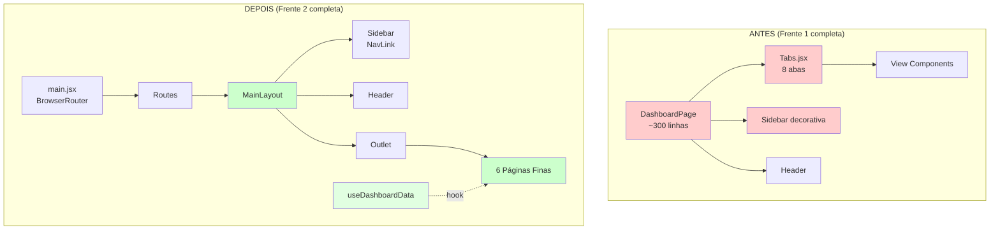

### Diagrama 2: Fluxo de Navegação

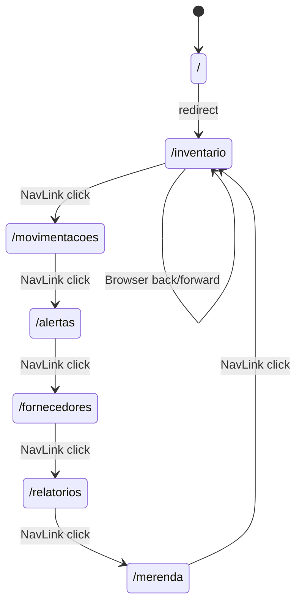

### Diagrama 3: Dependências de Componentes (Frente 2)

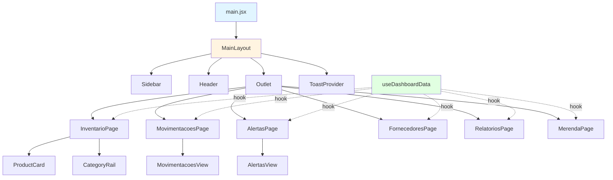


### Diagrama 4: Fluxo de Dados com useDashboardData

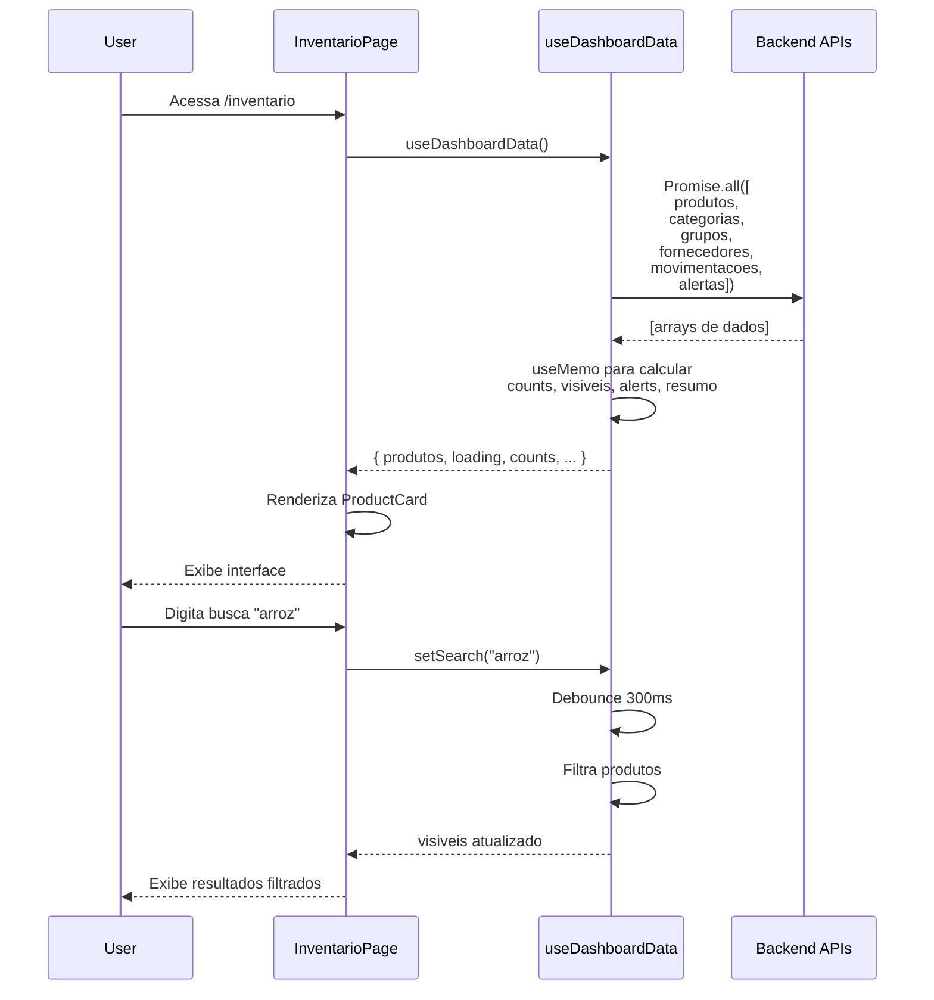

### Diagrama 5: Estrutura de Sidebar com Seções

```mermaid
graph TD
    A[Sidebar] --> B[Operacional]
    A --> C[Gestão]
    A --> D[Sistema]
    
    B --> B1[/inventario]
    B --> B2[/movimentacoes]
    B --> B3[/alertas]
    
    C --> C1[/fornecedores]
    C --> C2[/relatorios]
    C --> C3[/merenda]
    
    D --> D1[/perfil]
    D --> D2[/configuracoes]
    
    style B fill:#e3f2fd
    style C fill:#e8f5e9
    style D fill:#fff3e0
    style B1 fill:#90caf9
    style B2 fill:#90caf9
    style B3 fill:#90caf9
    style C1 fill:#a5d6a7
    style C2 fill:#a5d6a7
    style C3 fill:#a5d6a7
    style D1 fill:#ffcc80
    style D2 fill:#ffcc80
```


## Technical Considerations

### 1. React Router DOM v7

**Versão instalada**: v7 (já presente no package.json)

**Mudanças em relação a v6**:
- API de rotas permanece compatível
- BrowserRouter, Routes, Route, Navigate mantidos
- NavLink com className como função mantido

**Validação de compatibilidade**:
```bash
# Verificar versão instalada
cat frontend/package.json | grep react-router-dom
```

### 2. Performance do Promise.all

**Estratégia atual**: 6 requisições simultâneas

**Prós**:
- Reduz tempo total de carregamento
- Paralelização de I/O

**Contras**:
- Se uma falhar, todas falham

**Mitigação**:
```javascript
// Alternativa: Promise.allSettled (considera para otimização futura)
const results = await Promise.allSettled([...])
const [produtosData] = results[0].status === 'fulfilled' 
  ? results[0].value 
  : []
```

**Decisão**: Manter Promise.all (comportamento existente do DashboardPage).

### 3. Debounce de Busca

**Implementação**: useEffect com setTimeout

**Delay**: 300ms (padrão UX recomendado)

**Alternativa considerada**: Biblioteca de debounce (lodash, use-debounce)

**Decisão**: Implementação manual (evitar nova dependência, conforme Requirement 12).

### 4. Tamanho das Páginas (≤60 linhas)

**Justificativa**: Páginas devem ser finas e focadas

**Estratégia de cumprimento**:
- Componentes de view já extraídos em features/
- Páginas apenas compõem componentes
- Lógica de dados em useDashboardData

**Exemplo de violação (evitar)**:
```jsx
// ❌ NÃO FAZER: Lógica inline na página
export default function InventarioPage() {
  const [produtos, setProdutos] = useState([])
  
  useEffect(() => {
    // 50 linhas de lógica de fetch
  }, [])
  
  // 30 linhas de renderização
}
```

**Exemplo correto**:
```jsx
// ✅ FAZER: Página fina
export default function InventarioPage() {
  const { visiveis, loading } = useDashboardData()
  
  if (loading) return <Spinner />
  
  return <InventarioView produtos={visiveis} />
}
```


### 5. Estado de Loading Consistente

**Problema**: Múltiplas páginas precisam de loading state

**Solução**: useDashboardData retorna `loading` booleano

**Padrão de uso**:
```jsx
export default function Page() {
  const { dados, loading } = useDashboardData()
  
  if (loading) {
    return (
      <div className="flex items-center justify-center h-full">
        <div className="text-neutral-500">Carregando...</div>
      </div>
    )
  }
  
  return <View dados={dados} />
}
```

**Alternativa futura**: Spinner component reutilizável em components/ui/

### 6. Tabs.jsx - Remoção da Navegação Principal

**Ação**: NÃO deletar o componente

**Justificativa**: 
- Tabs.jsx pode ser útil para navegação interna de componentes
- Exemplo: Abas dentro de uma página específica
- Componente genérico e reutilizável

**Localização final**: `components/ui/Tabs.jsx` (já movido na Frente 1)

**Uso futuro**: Navegação por abas dentro de páginas (não para navegação principal)

### 7. Compatibilidade com Design Tokens

**Garantia**: Todos os componentes novos usam tokens existentes

**Tokens relevantes**:
```css
/* index.css @theme */
--brand: #2d5a3d;
--neutral-50: #f4f1e7;
--neutral-100: #e8e5dc;
/* ... */
```

**Uso em Sidebar**:
```jsx
// Estilo ativo usa token brand
className={isActive 
  ? 'bg-brand text-[#f4f1e7]'  // ✅ Usa tokens
  : 'text-neutral-600 hover:bg-neutral-100'
}
```

### 8. Responsividade da Sidebar

**Breakpoints**:
- Desktop (≥1024px): `w-56` (14rem)
- Mobile (<1024px): `w-16` (4rem)

**Implementação**:
```jsx
<aside className="w-56 lg:w-56 md:w-16">
  {/* ... */}
  <span className="hidden lg:inline">{label}</span>
</aside>
```

**Validação**:
- [ ] Desktop: Labels visíveis, largura 14rem
- [ ] Mobile: Apenas ícones, largura 4rem
- [ ] Transição suave entre breakpoints


### 9. Impacto em Apps Independentes

**Garantia**: app-alunos/ e app-cozinha/ não são afetados

**Razão**: 
- Modificações exclusivamente em frontend/src/
- Apps independentes têm seus próprios src/ e package.json
- Nenhum código compartilhado

**Validação**:
```bash
# Apps independentes devem continuar funcionando
cd app-alunos
npm run dev

cd ../app-cozinha
npm run dev
```

### 10. Rollback de Emergência

Se erros críticos forem detectados após Frente 2:

```bash
# Opção 1: Git reset (se não commitado)
git reset --hard HEAD

# Opção 2: Git revert (se já commitado)
git log  # Encontrar commits da Frente 2
git revert <commit-hash>

# Opção 3: Restauração manual
# - Restaurar DashboardPage.jsx
# - Remover páginas finas
# - Remover useDashboardData
# - Reverter main.jsx para versão anterior
# - Reverter Sidebar para versão decorativa
```

### 11. Checklist de Pré-Requisitos da Frente 2

Antes de iniciar:

- [x] **Frente 1 concluída**: Estrutura de diretórios modular
- [ ] **Branch de trabalho**: `git checkout -b feature/frontend-architecture-frente-2`
- [ ] **Código commitado**: `git status` limpo
- [ ] **Testes passando**: `npm test` 100% OK
- [ ] **Build funcionando**: `npm run build` sem erros
- [ ] **Tempo reservado**: Estimativa 3-5 horas

### 12. Riscos e Mitigações (Frente 2)

| Risco | Probabilidade | Impacto | Mitigação |
|-------|---------------|---------|-----------|
| useDashboardData com bugs de dados | Média | Alto | Testes unitários do hook |
| Páginas renderizando vazias | Média | Alto | Validar cada página antes de próxima |
| NavLink não funcional | Baixa | Médio | Testar navegação após refatoração |
| Performance degradada | Baixa | Médio | Manter Promise.all (já otimizado) |
| DashboardPage deletado prematuramente | Alta | Crítico | Somente deletar após validação completa |


## Entregáveis da Frente 2

Ao concluir a Frente 2, os seguintes artefatos devem existir:

1. **Hook customizado**:
   - `src/hooks/useDashboardData.js` com lógica de dados reutilizável

2. **Layout wrapper**:
   - `src/layouts/MainLayout.jsx` com Sidebar + Header + Outlet

3. **Páginas finas** (6 arquivos, ≤60 linhas cada):
   - `src/pages/InventarioPage.jsx`
   - `src/pages/MovimentacoesPage.jsx`
   - `src/pages/AlertasPage.jsx`
   - `src/pages/FornecedoresPage.jsx`
   - `src/pages/RelatoriosPage.jsx`
   - `src/pages/MerendaPage.jsx`

4. **Sidebar refatorado**:
   - `src/layouts/Sidebar.jsx` com NavLink funcional

5. **Roteamento configurado**:
   - `src/main.jsx` com BrowserRouter e 8 rotas

6. **Arquivo removido**:
   - `src/pages/DashboardPage.jsx` (deletado)

7. **Validação completa**:
   - Build e testes passando
   - Navegação funcional

8. **Documentação**:
   - Este design document expandido

9. **Commit Git**:
   - Mudanças commitadas com mensagem descritiva

## Critérios de Aceitação (Frente 2)

A Frente 2 está completa quando:

✅ **Estrutura**:
- [ ] useDashboardData.js criado em hooks/
- [ ] MainLayout.jsx criado em layouts/
- [ ] 6 páginas criadas em pages/
- [ ] Sidebar.jsx refatorado com NavLink
- [ ] main.jsx configurado com rotas

✅ **Funcionalidade**:
- [ ] Navegação funciona em todas as 6 rotas
- [ ] URL muda ao clicar em itens da Sidebar
- [ ] Estilo ativo aplicado corretamente no NavLink
- [ ] useDashboardData retorna dados em todas as páginas
- [ ] Busca funciona com debounce de 300ms
- [ ] Todos os modais funcionam nas páginas

✅ **Qualidade**:
- [ ] `npm run build` completa sem erros
- [ ] `npm test` passa 100%
- [ ] `npm run dev` inicia sem erros de console
- [ ] Nenhum warning de React no navegador
- [ ] Páginas ≤60 linhas cada

✅ **Limpeza**:
- [ ] DashboardPage.jsx deletado
- [ ] Tabs.jsx removido da navegação principal
- [ ] Nenhum código morto ou import não usado

✅ **Validação**:
- [ ] Apps app-alunos/ e app-cozinha/ não afetados
- [ ] Backend continua funcionando (python manage.py test)
- [ ] Responsividade validada (desktop + mobile)


---

## Próximos Passos (Fora do Escopo da Frente 2)

Após conclusão da Frente 2, as próximas atividades serão:

**Frente 3: Simplificação e Páginas Finais**
- Simplificar ProductCard (remover botões de ação, exibir apenas botão "Ver detalhes")
- Mover botões de ação para DetailsModal
- Criar PerfilPage com informações do usuário e logout
- Criar ConfiguracoesPage com preferências (mock/real, prazo validade, densidade)
- Atualizar Header com avatar clicável que navega para /perfil
- Completar todas as 8 rotas do sistema

**Benefícios esperados após Frente 2**:
- ✅ Navegação real com URLs significativas
- ✅ Botão voltar do navegador funcional
- ✅ Links compartilháveis para seções específicas
- ✅ Código mais organizado e manutenível
- ✅ Páginas finas e focadas
- ✅ Lógica reutilizável centralizada em hook
- ✅ Sidebar funcional com feedback visual

---

**Versão do Documento**: 2.0 (Frente 1 + Frente 2)  
**Data**: 2024  
**Status**: Frente 2 especificada e pronta para implementação

