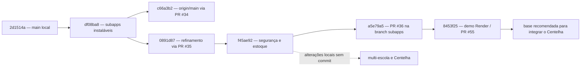

# Handoff técnico — branches, alterações e preparação para o Centelha

Data do levantamento: 18 de agosto de 2026.

## Resumo executivo

O repositório possui três camadas diferentes de evolução que ainda não estão reunidas na `main`:

1. A `origin/main` contém as melhorias gerais e a primeira versão instalável dos aplicativos de alunos e cozinha, encerrando na PR #34.
2. A branch `new/demo-render-prontidao`, atualmente na PR #55, contém a evolução operacional mais completa: segurança, experiência dos subaplicativos, operação offline, auditoria, correções de estoque e preparação da demonstração na Render.
3. A preparação multi-escola para o Centelha está somente no diretório de trabalho da branch `new/seguranca-cardapios-lotes-offline`, ainda sem commit e baseada em uma versão anterior à branch de demonstração.

Portanto, a `main` não está faltando apenas o trabalho do Centelha. Ela também ainda não recebeu a PR #55. O caminho seguro é primeiro revisar e incorporar a PR #55 e, depois, transportar as alterações do Centelha para uma branch nova criada sobre essa base atualizada.

## Mapa das branches

Observação: `origin/main` e `df08ba8` possuem o mesmo conteúdo de arquivos. Os três commits exclusivos da `origin/main` são os merges das PRs #11, #33 e #34.

## Estado de cada branch

### `main` local

- Commit: `2d1514a` — `explicando como rodar o projeto`.
- Situação: 17 commits atrás da `origin/main`.
- Conteúdo: não representa a versão atualmente aceita no GitHub.
- Ação recomendada: atualizar somente depois de proteger as alterações locais atuais. Não usar esta branch como base para novo desenvolvimento.

### `origin/main`

- Commit: `c66a3b2` — merge da PR #34.
- Inclui:
  - PR #11: melhorias de segurança, experiência, manutenção e preparação de implantação;
  - PR #33: integração de grupos e correções dos alertas de estoque;
  - PR #34: evolução operacional e instalação dos aplicativos de alunos e cozinha.
- Não inclui:
  - os refinamentos da PR #35;
  - segurança e operação de estoque da PR #36;
  - preparação da demonstração da PR #55;
  - alterações multi-escola e materiais do Centelha.

### `new/melhorias-fases-1-2`

- Commit local: `d1ad9f6`.
- Commit remoto: `0023f2a`.
- Situação: a branch local está dois commits à frente da correspondente remota.
- Principais alterações:
  - fortalecimento de autenticação e sessões;
  - estabilização da experiência do produto;
  - redução de dívida técnica;
  - crescimento e polimento da plataforma;
  - integração de grupos e alertas ao estoque;
  - reforço da sessão do aplicativo de alunos;
  - limite de presença de 45 alunos.
- Observação: os dois commits locais adicionais chegaram à `main` por meio da cadeia da PR #34, embora não estejam na branch remota com o mesmo nome.

### `new/subapps-fases-2-3`

- Commit local: `df08ba8`.
- Commit remoto: `a5e79a5`.
- Situação: a branch local está oito commits atrás da correspondente remota.
- Alterações até o commit local:
  - baixa de produção idempotente;
  - unificação de turmas e separação de refeições;
  - revisão da consistência operacional;
  - restrições de acesso e detalhamento da rotina diária;
  - simplificação de turmas integrais;
  - instalação PWA dos aplicativos de alunos e cozinha.
- Alterações adicionais na branch remota:
  - refinamentos da PR #35;
  - segurança e operação do estoque da PR #36.
- Observação: a `origin/main` tem o mesmo conteúdo da ponta local `df08ba8`, mas ainda não contém as oito alterações posteriores existentes na branch remota.

### `new/refinamento-apps-3-fases`

- Commit local e remoto: `0891d87`.
- PR relacionada: #35, incorporada em `new/subapps-fases-2-3`, não diretamente na `main`.
- Principais alterações:
  - identidade visual e instalação dos subaplicativos;
  - sincronização do estado diário;
  - histórico operacional e monitoramento seguro;
  - prevenção de tela branca causada por cache antigo.

### `new/seguranca-cardapios-lotes-offline`

- Commit local e remoto: `f45ae92`.
- Branch atualmente aberta no diretório principal.
- PR relacionada: #36, incorporada em `new/subapps-fases-2-3`, não diretamente na `main`.
- Principais alterações versionadas:
  - reforço das regras de segurança e da operação do estoque;
  - melhoria do login;
  - separação dos bloqueios dos aplicativos de alunos e cozinha.
- Situação especial: contém também todas as alterações locais do Centelha descritas mais adiante, ainda sem commit.

### `new/demo-render-prontidao`

- Commit local e remoto: `8453f25`.
- PR relacionada: [#55 — prepara demonstração segura do EduStock](https://github.com/DEV-CiceroJose/EDUSTOCK/pull/55), aberta contra a `main`.
- Diretório isolado: `.worktrees/demo-render-prontidao`, atualmente sem alterações pendentes.
- Está 25 commits à frente de `new/seguranca-cardapios-lotes-offline` e reúne:
  - incorporação das PRs #35 e #36;
  - documentação e configuração da demonstração na Render;
  - centralização do modo de demonstração e bloqueio de dados simulados indevidos;
  - preservação, exibição e validação da fila offline;
  - correções nas conversões de consumo do estoque;
  - estorno auditado de movimentações e bloqueio de estornos inválidos;
  - gestão segura de usuários e proteção do último administrador;
  - rotação protegida das contas de demonstração;
  - consistência entre estoque e cardápio;
  - fechamento de permissões e recuperação da demonstração;
  - testes PostgreSQL e cenários integrados no CI;
  - liberação correta das sessões dos subaplicativos;
  - correção de CORS para o cabeçalho operacional usado pelas PWAs.
- Estado recomendado: esta é a base funcional mais completa e deve chegar à `main` antes da integração definitiva do Centelha.

### Branches automáticas de dependências

Há PRs automáticas abertas para atualização de dependências, inclusive atualizações principais de Django e Django REST Framework. Elas devem ser tratadas separadamente da integração funcional. Misturar essas atualizações com a PR #55 ou com o trabalho do Centelha aumentaria o risco e dificultaria identificar regressões.

## Pull requests funcionais

| PR | Base | Origem | Estado | Resultado principal |
|---|---|---|---|---|
| [#11](https://github.com/DEV-CiceroJose/EDUSTOCK/pull/11) | `main` | `new/melhorias-fases-1-2` | incorporada | melhorias gerais de segurança, produto e manutenção |
| [#33](https://github.com/DEV-CiceroJose/EDUSTOCK/pull/33) | `main` | `new/melhorias-fases-1-2` | incorporada | grupos e alertas de estoque |
| [#34](https://github.com/DEV-CiceroJose/EDUSTOCK/pull/34) | `main` | `new/subapps-fases-2-3` | incorporada | operação e instalação das PWAs |
| [#35](https://github.com/DEV-CiceroJose/EDUSTOCK/pull/35) | `new/subapps-fases-2-3` | `new/refinamento-apps-3-fases` | incorporada | refinamento visual, sincronização e monitoramento |
| [#36](https://github.com/DEV-CiceroJose/EDUSTOCK/pull/36) | `new/subapps-fases-2-3` | `new/seguranca-cardapios-lotes-offline` | incorporada | segurança e operação de estoque |
| [#55](https://github.com/DEV-CiceroJose/EDUSTOCK/pull/55) | `main` | `new/demo-render-prontidao` | aberta | consolidação funcional e demonstração segura na Render |

## Alterações locais ainda sem commit — preparação para o Centelha

O levantamento começou com 26 arquivos versionados modificados, somando 1.212 inclusões e 152 exclusões, além de nove novas entradas relevantes não versionadas. A pasta `.worktrees/` já existia e não faz parte da implementação do Centelha.

### Domínio multi-escola

- Criação da hierarquia `Município → Escola → vínculos de usuários`.
- Papéis de rede e escola para gestor de rede, gestor escolar, nutricionista e operação.
- Vinculação da escola aos dados operacionais de estoque, cardápio, presença, produção e movimentações.
- Migração do conteúdo existente para uma escola-piloto padrão, preservando o histórico.
- Migrações novas:
  - `plataforma/migrations/0006_escola_municipio_tokenacesso_papel_rede_and_more.py`;
  - `core/migrations/0022_cardapiomodelomunicipal_catalogoprodutomunicipal_and_more.py`;
  - `core/migrations/0023_contagemestoque.py`.

### Segurança e isolamento de dados

- Derivação da escola autorizada a partir da autenticação e dos vínculos do usuário.
- Permissões para separar operações escolares das operações da rede municipal.
- Tokens operacionais e login por PIN vinculados à escola.
- Filtragem dos dados por escola nos serviços, relatórios, alertas, APIs e administração.
- Troca controlada da escola ativa para usuários autorizados da rede.

### Operação municipal e indicadores

- APIs para municípios, escolas, vínculos, importação e visão consolidada da rede.
- Catálogo municipal de produtos e modelos centrais de cardápio.
- Aplicação de cardápios municipais por escola.
- Indicadores de refeições planejadas, produzidas e servidas.
- Registro de sobras, perdas, custo por refeição e atendimento do cardápio.
- Contagem física de estoque e cálculo de divergência.
- Rastreamento do indicador consolidado até a escola e a operação de origem.

### Painel e aplicativos

- Nova página municipal no painel administrativo.
- Proteção de rota específica para usuários com papel de rede.
- Seleção de escola autorizada e consolidação dos indicadores.
- Envio do contexto escolar nas sessões dos aplicativos de alunos e cozinha.
- Associação das operações offline à escola correta.

### Evidências e materiais do Centelha

- `docs/CENTELHA_PREPARACAO.md`: plano técnico e critérios de conclusão.
- `docs/centelha/`: modelos para relatório do piloto, entrevistas, cartas de intenção e avaliação simulada.
- Atualização do `README.md` para documentar a operação multi-escola e os novos recursos.

### Cobertura criada

- `core/tests/test_rede_multi_escola.py`: isolamento entre escolas, permissões, indicadores, importação, cardápio municipal, operação e contagem de estoque.
- Testes existentes foram adaptados para preservar os contratos das rotas operacionais.

## Validações já executadas

Para as alterações locais do Centelha:

- suíte completa do backend: 204 testes aprovados antes do último ajuste no cardápio municipal;
- após esse último ajuste: 26 testes focados em rede, cardápio e operação aprovados;
- painel administrativo: 125 testes aprovados;
- aplicativo de alunos: 26 testes aprovados;
- aplicativo de cozinha: 30 testes aprovados;
- verificação de tipos e compilação das três interfaces aprovadas;
- migrações aplicadas no banco local com preservação dos totais do piloto.

Antes da futura PR do Centelha, ainda é necessário repetir a suíte completa do backend já com o último ajuste incluído e executar a validação integrada online/offline sobre a base da PR #55.

## Conflitos e riscos de integração

As alterações locais do Centelha e a branch `new/demo-render-prontidao` modificam 17 caminhos em comum:

- `README.md`;
- `app-alunos/src/api.js`;
- `app-cozinha/src/api.js`;
- `core/admin.py`;
- `core/api_views.py`;
- `core/models.py`;
- `core/operacao.py`;
- `core/serializers.py`;
- `core/services.py`;
- `frontend/src/api/http.ts`;
- `frontend/src/api/index.ts`;
- `plataforma/admin.py`;
- `plataforma/authentication.py`;
- `plataforma/models.py`;
- `plataforma/permissions.py`;
- `plataforma/serializers.py`;
- `plataforma/views.py`.

Isso não significa que o trabalho seja incompatível, mas impede uma integração automática sem revisão. É necessário preservar simultaneamente o isolamento multi-escola e as correções posteriores de segurança, demonstração, estoque e operação offline.

## Sequência recomendada para continuar

1. Preservar as alterações atuais do Centelha em uma branch própria e em commits pequenos, sem incluir `.worktrees/`.
2. Revisar a PR #55 e incorporá-la à `main` quando estiver aprovada.
3. Atualizar a `main` local para refletir a `origin/main`.
4. Criar uma nova branch do Centelha a partir da `main` já contendo a PR #55.
5. Transportar os commits do Centelha para essa branch e resolver manualmente os 17 caminhos sobrepostos.
6. Revisar as migrações para garantir dependências corretas e preservação do histórico da escola-piloto.
7. Executar:
   - suíte completa do backend;
   - testes, verificação de tipos e compilação das três interfaces;
   - testes com PostgreSQL;
   - fluxo real de presença, produção, baixa FEFO e consolidação municipal;
   - operação offline e sincronização idempotente por escola;
   - teste de isolamento entre pelo menos três escolas;
   - validação no navegador das PWAs, incluindo CORS e cabeçalho operacional.
8. Abrir uma PR exclusiva para o Centelha, sem misturar atualizações automáticas de dependências.

## Critério de entrega da próxima etapa

A integração técnica estará pronta quando:

- a `main` contiver a PR #55;
- o trabalho do Centelha estiver em branch própria, sem alterações soltas;
- os 17 pontos de sobreposição tiverem sido revisados;
- todas as suítes estiverem aprovadas na base consolidada;
- o banco do piloto migrar sem perda de totais;
- três escolas puderem operar isoladamente e ser consolidadas pela secretaria;
- a futura PR apresentar claramente produto, migrações, segurança, testes e evidências do piloto.

## Cuidados para o próximo responsável

- Não limpar, restaurar ou trocar a branch atual antes de preservar as alterações sem commit.
- Não apagar `.worktrees/`; ela contém o checkout isolado e limpo da branch de demonstração.
- Não partir da `main` local `2d1514a`, pois ela está desatualizada.
- Não assumir que a PR #36 entrou na `main`; ela foi incorporada à branch `new/subapps-fases-2-3`.
- Não considerar a PR #55 concluída enquanto ela permanecer aberta.
- Não usar apenas testes simulados como prova da integração real das PWAs.
- Não adicionar previsão por IA antes de existir base histórica suficiente e validação setorial.
